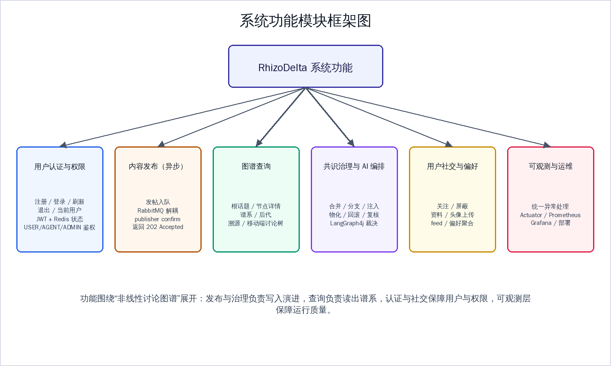
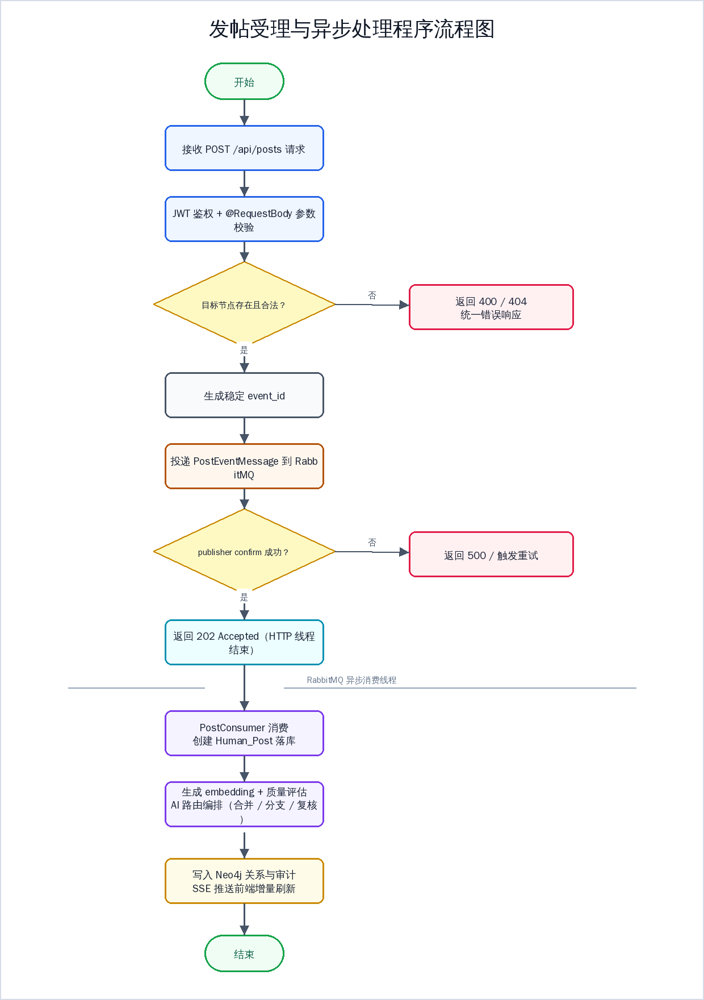
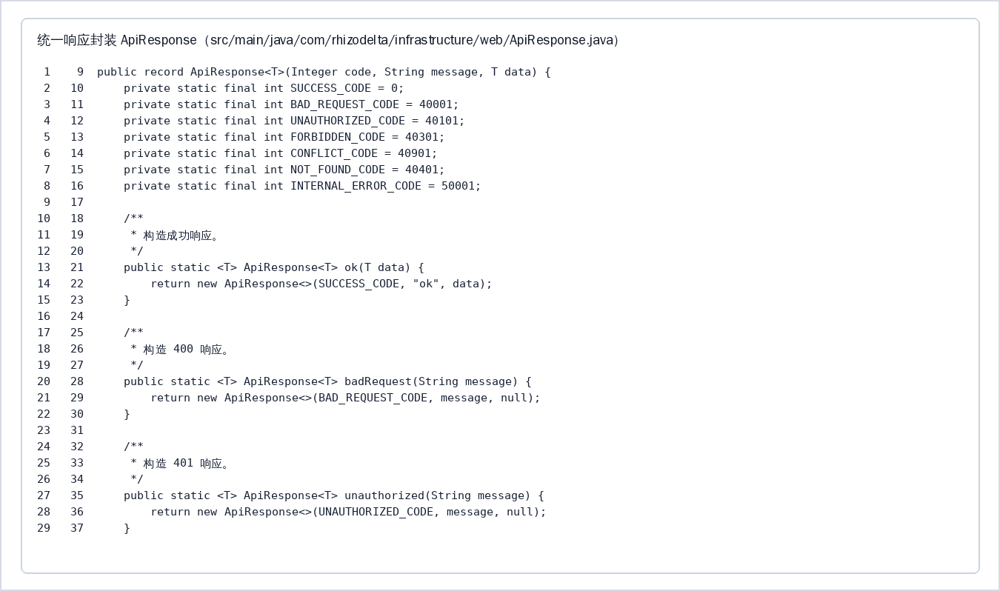
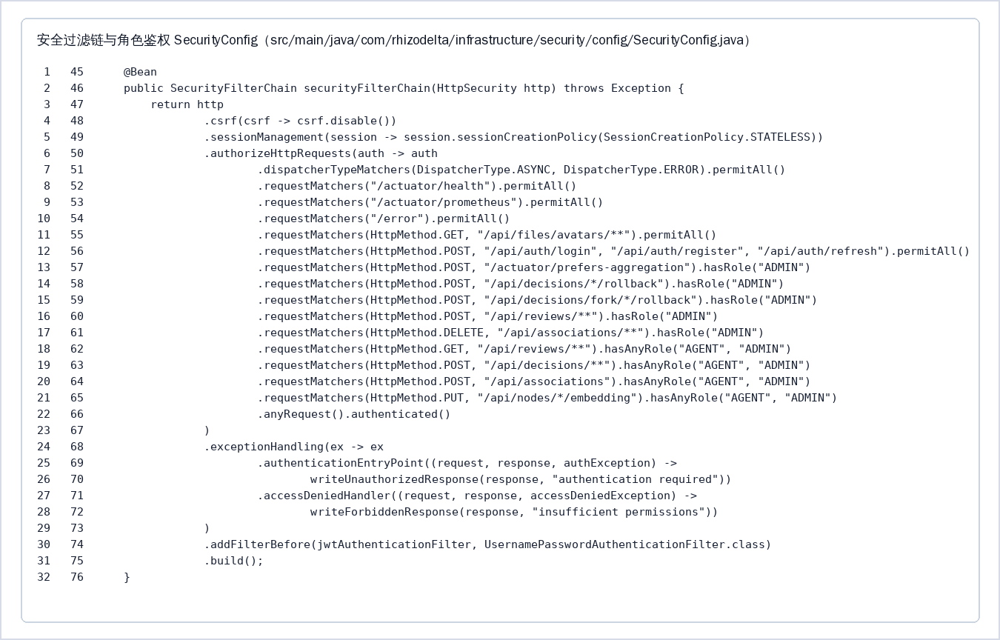
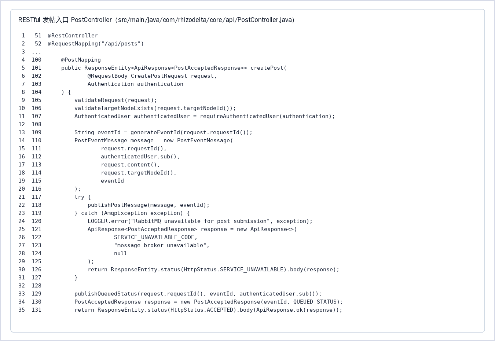
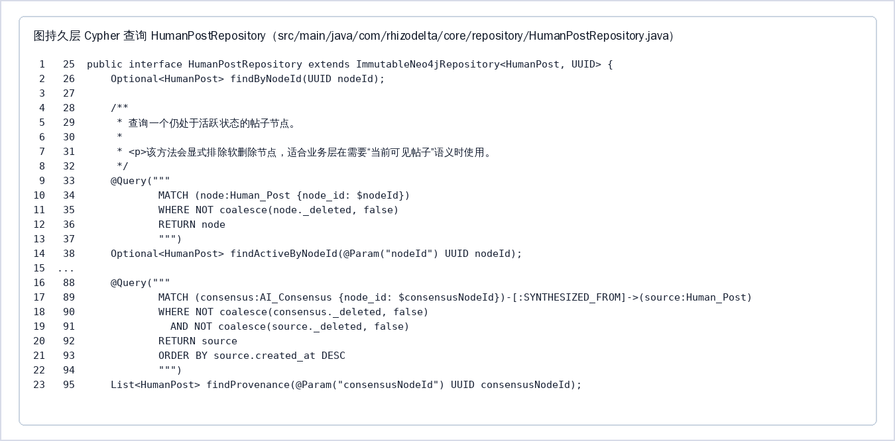
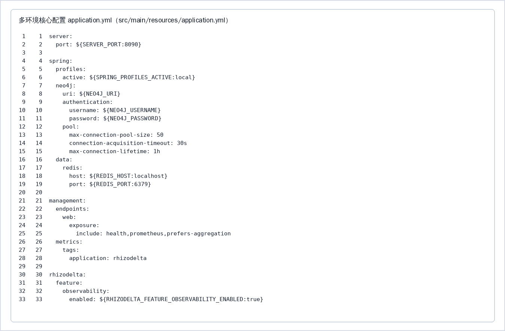

# 期末考查报告（《JavaEE 企业级 Web 应用开发实战》）

> 本报告按学校《期末考查（课程设计）报告书》模板组织：封面 → 期末考查计划书 → 报告正文（覆盖①系统功能与框架图 ②数据库数据字典 ③详细设计与流程图 ④模块界面与核心源代码） → 学生签名。Word/PDF 版含完整封面与计划书表格。

**封面信息**：姓名 刘小麟｜学号 2052442135｜系别 信息工程学院｜专业 软件技术｜年级 2024 级｜班级 软件技术 14 班｜指导教师 陈晓军｜时间 2026 年 6 月 15 日 至 2026 年 6 月 26 日｜所在单位 2024 级 信息工程 系 软件技术 专业 14 班

代码仓库：https://github.com/TUNTIANHAMMA-2/RhizoDelta　本地开发目录：`/home/tthm/workspace/RhizoDelta`

## 期末考查计划书

- **课程设计题目**：RhizoDelta 图谱化非线性讨论系统（JavaEE 企业级 Web 应用后端实现）
- **课程设计目的**：
1. 能够独立完成从项目创建、多环境配置到分层架构设计的完整 Web 应用搭建；
2. 熟练使用 MyBatis-Plus 或 JPA 进行数据持久化操作；
3. 掌握事务管理、RESTful API 设计、网页数据交互等核心技术；
4. 完成系统的单元测试、API 文档生成、Maven 打包及 java -jar 部署，并提交完整的项目源码与设计文档。
- **课程设计内容要求**：
1. 项目初始化与环境配置：使用 Spring Initializr 创建 Spring Boot 项目，正确引入 Spring Boot、JPA、Redis、RabbitMQ 等依赖；配置 application.yml 多环境文件（dev/prod），包含服务器端口、数据源、Redis 连接、JPA 或 MyBatis-Plus 日志等核心配置；使用 Lombok 简化实体类开发，配置热部署工具。
2. 数据库设计与持久层开发：完成项目的数据库设计；使用 MyBatis-Plus 或 JPA 完成各表的 CRUD 操作；为权限管理业务方法添加 @Transactional 事务控制。
3. web 层与接口开发：设计符合 RESTful 规范的接口（GET、POST、PUT、DELETE）；使用 @RestController、@RequestMapping 等注解完成 Controller 层开发；掌握 @RequestParam、@PathVariable、@RequestBody 等参数接收方式；实现统一响应结果封装类（包含 code、message、data 字段）。
4. 实训报告：撰写完整的课程设计报告（包含需求分析、数据库设计、核心代码展示、运行截图、项目总结）；提交项目源代码（代码结构规范，注释清晰）；提交数据库建表 SQL 脚本及测试数据。
- **课程设计时间安排**：
- 2026 年 6 月 15 日：项目初始化、Maven 依赖与多环境配置（Neo4j / Redis / RabbitMQ）。
- 2026 年 6 月 17 日：数据库（图）模型设计与持久层 Repository / Cypher 开发。
- 2026 年 6 月 19 日：RESTful 接口、统一响应封装、Service 分层与事务设计。
- 2026 年 6 月 22 日：安全认证（JWT / Redis）、RabbitMQ 异步发帖与 SSE 实时推送。
- 2026 年 6 月 24 日：单元测试、Maven 打包与 java -jar 部署联调。
- 2026 年 6 月 26 日：整理运行截图、撰写课程设计报告并提交源码与文档。

> 说明：考查方案以 Spring Boot + MyBatis-Plus/JPA 的单表 CRUD 系统作为保底要求；RhizoDelta 实际采用 Spring Boot + Spring Data Neo4j + RabbitMQ + Redis + React 的图谱讨论系统实现。报告据此既说明课程知识点的对应实现，也说明项目超出考查方案的工程能力。

## 一、系统功能描述与功能框架图

RhizoDelta 是一个基于图谱的非线性讨论系统。它把传统论坛的线性聊天记录组织为“共识主干 + 异议分支”的知识图谱：用户提交观点后，后端通过 Spring Boot 接收请求，RabbitMQ 解耦异步处理，Neo4j 保存不可变 DAG，AI 编排层对内容进行召回、裁决、反思和落库，前端通过 SSE 接收增量事件并刷新图谱视图。

系统主要功能：用户注册/登录/刷新/退出与 JWT 鉴权；发布话题或回复（返回 `202 Accepted` 后台异步写入）；根话题、节点详情、谱系、后代、溯源、移动端讨论树等查询；合并/分支/注入/物化/回滚/复核等治理操作与 AI 编排；关注/屏蔽/资料/头像/偏好聚合等社交能力；SSE 实时事件与可观测运维。




**技术选型与开发环境**：

| 层次 | 技术 |
|---|---|
| 后端语言与框架 | Java 17, Spring Boot 3.2.3 |
| Web 与接口 | Spring Web, RESTful API, SSE |
| 数据访问 | Spring Data Neo4j, Neo4jClient, Cypher |
| 数据库 | Neo4j 5 |
| 安全认证 | Spring Security, JWT, BCrypt |
| 缓存与会话状态 | Redis, RedisTemplate |
| 消息队列 | RabbitMQ, Spring AMQP |
| 文件存储 | MultipartFile, MinIO SDK, 本地兜底 |
| AI 编排 | LangChain4j 0.36.2, LangGraph4j 1.8.10 |
| 监控 | Actuator, Micrometer, Prometheus, Grafana |
| 前端 | React 19, TypeScript, React Router, Zustand, React Flow, Vite |
| 构建与测试 | Maven, JUnit 5, Spring Boot Test, Testcontainers, Vitest |

## 二、数据库设计与数据字典

考查方案要求 E-R 图和数据字典。RhizoDelta 使用 Neo4j 图数据库，数据模型为“节点 + 关系 + 属性 + 索引/约束”的图模型。


**数据核对说明**：2026 年 6 月 21 日对本机 RhizoDelta Neo4j 运行库执行只读核对，并结合 src/main/java 中的 Repository、Service 与 DatabaseInitializer 写入逻辑整理。

**核心节点数据字典**：

| 节点标签 | 当前库数量 | 主要属性 | 设计说明 |
| --- | --- | --- | --- |
| GraphNode（公共标签） | 17 | node_id, root_id, embedding, topic_id, _deleted, _deleted_at, quality_relevance, quality_density, quality_argumentation, quality_community_value, quality_overall, quality_evaluated_at | Human_Post、AI_Consensus、Result 共享的内容节点标签；谱系查询、向量检索、软删除和质量评分都基于该标签。 |
| Human_Post:GraphNode | 14 | node_id, request_id, content, author_id, target_node_id, root_id, created_at, embedding, topic_id, _merge_seq | 用户发帖、回复和治理分支节点；request_id 用于幂等创建，author_id 与 AUTHORED 边共同记录作者。 |
| AI_Consensus:GraphNode | 3 | node_id, decision_id, request_id, summary_content, agent_version, root_id, created_at, embedding | AI 合并、汇合等治理流程生成的共识摘要节点；通过 MERGED_INTO、SYNTHESIZED_FROM、CONVERGED_FROM 追溯来源。 |
| Result:GraphNode | 0（当前库暂无） | node_id, decision_id, request_id, content, operator_type, operator_id, root_id, created_at, embedding | 物化和跨结果综合产生的结果层节点；代码已实现，当前运行库暂未生成样本。 |
| Decision | 10 | decision_id, decision_type, operator_type, operator_id, reason, created_at | 治理动作的审计锚点；通过 RESULTED_IN 指向产出节点，并可被 REVIEWED 记录人工复核。 |
| UserAccount | 18 | user_id, username, password_hash, roles, status, created_at, status_changed_at | 认证账号节点；username 与 user_id 唯一，roles 支撑 Spring Security 角色鉴权。 |
| UserProfile | 18 | user_id, display_name, avatar_url, language, timezone, theme, notification_prefs, updated_at | 用户资料节点；当前库已使用 display_name、avatar_url、updated_at，其他字段由资料更新接口按需写入。 |
| Topic | 5 | topic_id, name, source_type, created_at | 话题入口节点；feed、关注、屏蔽和偏好聚合都以 topic_id 作为稳定标识。 |
| PreferenceEvent | 340 | event_id, type, weight, at, source_node_id | 用户 VIEW、EXPAND、DWELL、LIKE、SHARE 等偏好行为事件；由 EMITTED/TOWARD 接入用户和话题。 |

**核心关系数据字典**：

| 关系类型 | 当前库数量 | 起点 → 终点 | 关系属性 | 设计说明 |
| --- | --- | --- | --- | --- |
| AUTHORED | 14 | UserAccount -> Human_Post | authored_id, created_at | 账号创作帖子；authored_id 唯一，和 Human_Post.author_id 形成双重归属校验。 |
| HAS_PROFILE | 18 | UserAccount -> UserProfile | 无属性 | 账号与资料一对一关联；注册、资料迁移、头像上传都会保证该边存在。 |
| CONTINUES_FROM | 10 | Human_Post -> GraphNode | operator_type, operator_id, created_at, reason | 回复或注入节点指向被延续的父节点，属于版本演进 DAG。 |
| BRANCHED_FROM | 1 | Human_Post -> GraphNode | operator_type, operator_id, created_at, reason, operation_id | 分支或 fork 节点指向来源节点，参与 DAG 环检测。 |
| MERGED_INTO | 3 | AI_Consensus -> GraphNode | operator_type, operator_id, created_at, reason, decision_id | 共识节点指向被合并的目标节点，表达合并结果落点。 |
| SYNTHESIZED_FROM | 9 | AI_Consensus -> Human_Post | operator_type, operator_id, created_at, reason, decision_id | 共识节点到贡献帖子的溯源边，用于 SBOM 和摘要增量更新。 |
| RESULTED_IN | 10 | Decision -> GraphNode | created_at | 治理决策元数据指向实际产出节点，是审计查询的稳定入口。 |
| EMITTED | 340 | UserAccount -> PreferenceEvent | 无属性 | 用户产生偏好事件。 |
| TOWARD | 69 | PreferenceEvent -> Topic | 无属性 | 偏好事件指向话题，供 PREFERS 聚合任务读取。 |
| PREFERS | 1 | UserAccount -> Topic | weight, last_event_at, created_at, updated_at | 由 PreferenceEvent 聚合出的偏好投影边，用于个性化 feed 排序。 |
| FOLLOWS | 2 | UserAccount -> UserAccount/Topic/GraphNode | since, follow_id | 关注用户、话题或节点；当前库观测到 since，新版本创建时写 follow_id。 |
| MUTED | 0（当前库暂无） | UserAccount -> UserAccount/Topic/GraphNode | mute_id, since, reason | 屏蔽用户、话题或节点，feed 查询会按该边过滤。 |
| MATERIALIZED_FROM | 0（当前库暂无） | Result -> GraphNode | operator_type, operator_id, created_at, reason | 结果节点从普通图节点物化而来。 |
| CONVERGED_FROM | 0（当前库暂无） | AI_Consensus -> GraphNode | operator_type, operator_id, created_at, reason | 汇合决策中共识节点指向多个来源节点。 |
| CROSS_SYNTHESIZED_FROM | 0（当前库暂无） | Result -> Result | operator_type, operator_id, created_at, reason | 结果层跨综合来源边，单独做结果层环检测。 |
| CONCEPTUAL_OVERLAP / RELATES_TO | 0（当前库暂无） | GraphNode -> GraphNode | association_id, creator_id, confidence, reason, created_at | 语义关联层，不参与版本演进拓扑排序。 |
| REVIEWED / OPERATED | 0（当前库暂无） | UserAccount -> Decision/GraphNode | decision_id, outcome, operation_id, at | 人工复核和管理操作审计边。 |

**约束与索引设计**：

| 类别 | 约束/索引对象 | 作用 |
| --- | --- | --- |
| 唯一约束 | GraphNode.node_id; Human_Post.request_id/decision_id; AI_Consensus.decision_id; Result.decision_id; UserAccount.user_id/username; UserProfile.user_id; Topic.topic_id; Decision.decision_id; AUTHORED.authored_id | 保证节点、账号、话题、决策和作者关系可被幂等寻址，避免重复写入。 |
| 普通索引 | Human_Post.author_id/created_at/topic_id/operation_id; AI_Consensus.created_at/topic_id; Result.created_at/topic_id; Decision.created_at; PreferenceEvent.at | 支撑 feed、审计分页、话题筛选、分叉回滚和偏好事件窗口聚合。 |
| 关系索引 | MERGED_INTO.decision_id; BRANCHED_FROM.decision_id; AUTHORED.created_at; CONCEPTUAL_OVERLAP.association_id; RELATES_TO.association_id; FOLLOWS.since; MUTED.since; PREFERS.weight/updated_at | 支撑关系审计、关联删除、关注/屏蔽列表和 PREFERS 排序。 |
| 向量索引 | rhizodelta_graph_node_embedding_idx ON GraphNode.embedding | Neo4j 5 cosine 向量索引，用于相似节点召回和 AI 路由上下文构建。 |

与 MyBatis-Plus 的 `BaseMapper`/条件构造器/分页/逻辑删除/自动填充相对应的能力，由图实体、`*Repository`、参数化 Cypher、`PagingParams`、`_deleted` 属性与 `datetime()` 实现；权限管理等业务方法使用 `@Transactional` 控制事务边界。

## 三、系统功能详细设计与流程图

系统采用前后端分离 + 后端分层：`api` 层负责 HTTP 入口与响应；`service` 层承载业务规则与事务；`repository` 与 `Neo4jClient` 承担图数据库访问；`infrastructure` 包统一放置安全、消息、SSE、持久化初始化、Redis、文件存储与可观测能力。

**3.1 用户认证模块**：注册生成用户 ID 并以 BCrypt 保存密码哈希、创建 `UserProfile`；登录校验密码与状态后签发 access/refresh token；退出撤销 access token 并清理 refresh token。`SecurityConfig` 关闭 CSRF、采用无状态会话，并把 `JwtAuthenticationFilter` 放入过滤链；按 `USER`/`AGENT`/`ADMIN` 分权；`RefreshTokenService`/`TokenBlacklistService` 用 Redis 管理会话状态。

**3.2 发帖与异步处理模块（程序流程图）**：`PostController` 校验请求与认证用户、检查目标节点、生成稳定 `event_id`，投递 `PostEventMessage` 到 RabbitMQ；等待 publisher confirm 后返回 `202 Accepted`；`PostConsumer` 消费后创建 `Human_Post`、生成 embedding 与质量评分、触发 AI 路由、写入关系与审计，并经 SSE 推送前端。




**3.3 图谱查询模块**：`NodeQueryController`/`NodeQueryService` 提供根话题、节点详情、`lineage`、`children`、`topology-context`、`discussion-tree`、`provenance`、`associations` 查询，围绕图遍历与 DTO 转换组织，而非简单 `select *`。

**3.4 治理与 AI 编排模块**：`DecisionController` 暴露合并/分支/注入/物化/fork/cross-synth/join/rollback；`AiRoutingWorkflowService` 用 LangGraph4j 定义状态图（加载帖子→确保 embedding→向量召回→上下文裁剪→规则预过滤→LLM 裁决→反思校验→提交前守卫→执行合并/分支或建复核任务），规则层在高/低相似场景跳过 LLM 以降本提速。

**3.5 用户资料、头像、关注与偏好模块**：`FollowService`/`MuteService` 统一分页返回列表；`AvatarController` 以 `MultipartFile` 接收头像并存 MinIO/本地；`PrefersAggregationJob` 周期聚合偏好事件为 `PREFERS` 投影边。

**课程知识点对应**：RESTful（`@RestController`/`@RequestMapping`/`@PathVariable`/`@RequestBody`）、统一响应封装（`ApiResponse` 的 code/message/data）、Service 分层与 `@Transactional`、`@ControllerAdvice` 全局异常、Spring Security + JWT + Redis、RabbitMQ（交换机/队列/死信/确认/重试）、`MultipartFile` 文件上传、`@Scheduled` 定时任务、前端 Ajax/异步与状态管理均已落地。

## 四、系统模块实现：界面与核心源代码

### 4.1 运行界面

> 以下为运行界面截图占位，请在提交前替换为真实运行截图（下方先给出前端模块结构图作为说明）。

- 【截图占位】登录 / 注册页面
- 【截图占位】图谱工作台（桌面端 React Flow 视图）
- 【截图占位】节点详情与治理操作面板
- 【截图占位】移动端讨论树视图


### 4.2 主要源代码截图（真实代码）











## 五、课程知识点对应与评分标准自查

| 考查方案评分项 | 项目对应情况 |
|---|---|
| 文件齐全、命名规范 | 后端/前端/Docker/文档/测试/脚本齐全，目录按领域与层次拆分 |
| 数据库设计 | Neo4j 图模型：节点字典、关系字典、约束、索引、初始化逻辑 |
| 用户登录 / 退出 | 注册、登录、刷新、退出、JWT 校验、BCrypt 加密 |
| 权限管理 / 会话 | Spring Security 角色控制 + Redis 管理 refresh/黑名单/在线状态 |
| 列表 / 条件 / 分页查询 | feed、关注/屏蔽/审计/根话题列表；谱系/溯源等条件查询；`PagingParams` 分页 |
| 增加 / 删除 / 修改 | 发帖、建关联、关注、屏蔽、偏好、头像上传 / 删除关联、取关、删头像、回滚 / 资料更新、状态变更 |
| 模板下载 / Excel 导入导出 | 未实现（项目非表格数据管理，业务不需要） |
| 实训报告 | 本报告覆盖功能框架、数据字典、详细设计、界面与源代码、部署测试与总结 |

## 六、超出考查方案的工程能力

图数据库建模、不可变 DAG 设计、RabbitMQ 异步架构（confirm/return/重试/死信）、SSE 实时推送、LangChain4j + LangGraph4j 的 AI 编排、Actuator/Prometheus/Grafana 可观测、React + Zustand + React Flow 前后端分离、92 个后端测试 + 前端 Vitest、Docker Compose 容器化依赖。

## 七、部署、运行与测试

```bash
docker compose up -d neo4j rabbitmq redis
export DASHSCOPE_API_KEY=your_api_key_here
mvn spring-boot:run
cd frontend && npm install && npm run dev
mvn clean package && java -jar target/RhizoDelta-1.0-SNAPSHOT.jar
```

后端默认端口 `8090`，前端开发端口 `5173`，Vite 把 `/api` 代理到 `http://localhost:8090`。测试：`mvn test -Dspring.profiles.active=test`、`npm run build`、`npx vitest`，覆盖认证、发帖异步、决策、图查询、SSE、用户画像、偏好聚合、AI 路由与数据库初始化。

## 八、总结

RhizoDelta 从 JavaEE 企业级 Web 应用角度覆盖了 Spring Boot、Maven、多环境配置、RESTful、统一响应、Service 分层、事务、异常、安全认证、Redis、RabbitMQ、文件上传、测试与部署等课程知识点；并以 Neo4j 图数据库、前后端分离、SSE 实时推送、AI 编排和可观测体系体现了更复杂企业级系统的工程能力。与模板的技术路线差异源于项目主题超出“单表信息管理系统”，而非缺少基础能力。

学生签名：____________________　　指导教师签字（签章）：____________________
