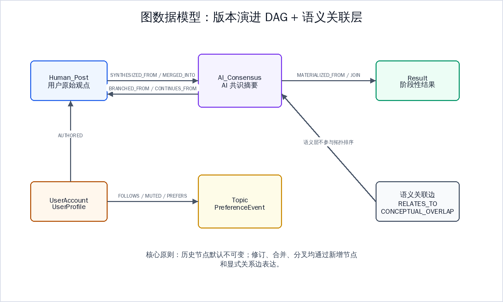
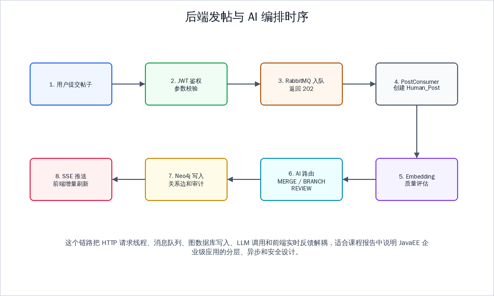
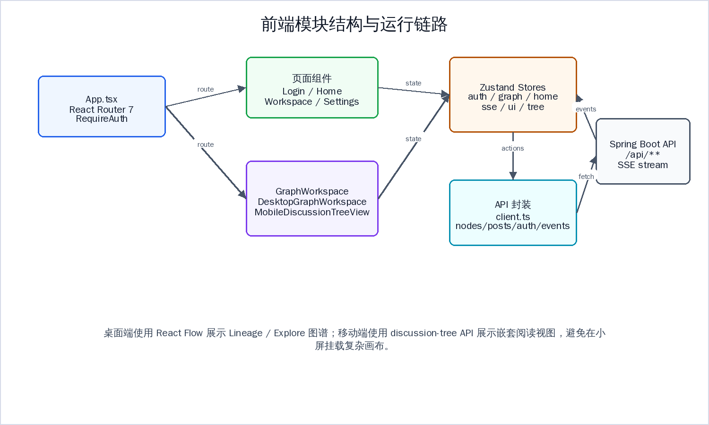

# 《JavaEE企业级Web应用开发实战》期末课程设计报告

项目名称：RhizoDelta 图谱化非线性讨论系统

代码仓库：https://github.com/TUNTIANHAMMA-2/RhizoDelta

本地开发目录：`/home/tthm/workspace/RhizoDelta`

说明：本报告依据《JavaEE企业级Web应用开发实战考查方案.docx》整理。考查方案以 Spring Boot + MyBatis-Plus 的单表 CRUD 系统作为保底要求，RhizoDelta 实际采用 Spring Boot + Spring Data Neo4j + RabbitMQ + Redis + React 的图谱讨论系统实现。报告因此重点说明两类内容：一是课程知识点在项目中的对应实现；二是项目超出课程考查方案的工程能力。

## 一、项目概述

RhizoDelta 是一个基于图谱的非线性讨论系统。传统论坛通常把讨论按时间线排列，RhizoDelta 则把用户观点组织为“共识主干 + 异议分支”的知识图谱：用户提交观点后，后端通过 Spring Boot 接收请求，RabbitMQ 解耦异步处理，Neo4j 保存不可变 DAG，AI 编排层对内容进行召回、裁决、反思和落库，前端通过 SSE 接收增量事件并刷新图谱视图。

本项目不是课程方案中列举的客户管理、学生管理、图书管理等单表 CRUD 系统，而是自定义的企业级 Web 应用。它仍覆盖 Spring Boot 项目创建、Maven 依赖管理、多环境配置、RESTful API、统一响应封装、Service 分层、声明式事务、全局异常处理、Spring Security、JWT、Redis、RabbitMQ、文件上传、单元测试、Maven 打包部署等课程考查知识点。

## 二、需求分析

### 2.1 业务需求

- 用户可以注册、登录、刷新 token、退出登录，并通过 JWT 访问受保护接口。
- 用户可以发布新话题或回复已有节点，系统返回 `202 Accepted`，后台异步写入图谱。
- 用户可以查看根话题、节点详情、谱系 lineage、后代 children、溯源 provenance、移动端 discussion-tree 等数据。
- Agent 或管理员可以执行合并、分支、注入、物化、回滚、语义关联、人工复核等治理操作。
- 系统需要保证历史节点不可变，所有演进通过新增节点和关系边表达。
- 系统需要提供 SSE 实时事件，让前端接收节点创建、边创建、决策完成、质量评分等增量状态。
- 用户可以维护个人资料、上传头像、关注/屏蔽用户，并产生偏好事件用于后续推荐排序。

### 2.2 对课程考查目标的适配

课程考查方案要求学生能够独立完成一个简单 Web 工程，重点检测 Spring Boot、持久化、认证授权、列表查询、增删改查、文件处理、测试与部署等基础能力。RhizoDelta 的领域模型更复杂，没有采用“单表信息管理”的形态，但核心能力可以对应到以下模块：

- “登录认证、权限管理、会话管理、Redis 存储状态”对应 `AuthController`、`SecurityConfig`、`JwtAuthenticationFilter`、`RefreshTokenService`、`TokenBlacklistService`。
- “列表展示、条件查询、分页查询”对应 `FeedController`、`FollowService`、`MuteService`、`AuditService`、`PagingParams`。
- “增加、删除、修改功能”对应发帖创建、语义关联创建/删除、用户资料更新、头像上传/删除、关注/屏蔽关系维护。
- “数据库设计”对应 Neo4j 图节点、关系、唯一约束、向量索引和初始化脚本。
- “文件上传/下载”对应头像上传、头像访问和 MinIO/本地存储适配。
- “项目部署交付”对应 Maven 打包、Docker Compose 启动 Neo4j/RabbitMQ/Redis、前端 Vite 构建和生产 JAR 运行。

## 三、技术选型与开发环境

| 层次 | 技术 |
|---|---|
| 后端语言与框架 | Java 17, Spring Boot 3.2.3 |
| Web 与接口 | Spring Web, RESTful API, SSE |
| 数据访问 | Spring Data Neo4j, Neo4jClient, Cypher |
| 数据库 | Neo4j 5 |
| 安全认证 | Spring Security, JWT, BCrypt |
| 缓存与会话状态 | Redis, RedisTemplate |
| 消息队列 | RabbitMQ, Spring AMQP |
| 文件存储 | MultipartFile, MinIO SDK, 本地文件兜底 |
| AI 编排 | LangChain4j 0.36.2, LangGraph4j 1.8.10 |
| 监控 | Spring Boot Actuator, Micrometer, Prometheus, Grafana |
| 前端 | React 19, TypeScript, React Router, Zustand, React Flow, Vite |
| 构建与测试 | Maven, JUnit 5, Spring Boot Test, Testcontainers, npm, Vitest |

## 四、系统总体设计


系统采用前后端分离和后端分层架构：

- `api` 层负责 HTTP 请求入口、参数接收和响应返回，例如 `PostController`、`NodeQueryController`、`AuthController`。
- `service` 层承载业务规则，例如 `PostService`、`DecisionService`、`EmbeddingService`、`FollowService`。
- `repository` 层和 `Neo4jClient` 承担图数据库访问，例如 `HumanPostRepository`、`AIConsensusRepository`、`TopicRepository`。
- `infrastructure` 包统一放置安全、消息、SSE、持久化初始化、Redis、文件存储和可观测性能力。
- `frontend/src` 中按 API、组件、hooks、stores、lib 拆分前端职责，使用 Zustand 管理认证、图谱、SSE 和界面状态。

## 五、数据库设计



课程考查方案要求 E-R 图和数据字典。RhizoDelta 使用 Neo4j 图数据库，因此数据模型不是传统关系型表，而是“节点 + 关系 + 属性 + 索引/约束”的图模型。

### 5.1 核心节点字典

| 节点标签 | 主要属性 | 说明 |
|---|---|---|
| `Human_Post` | `node_id`, `content`, `author_id`, `created_at`, `embedding` | 用户提交的观点节点 |
| `AI_Consensus` | `node_id`, `content`, `created_at`, `decision_id` | AI 或治理流程生成的共识节点 |
| `Result` | `node_id`, `content`, `created_at` | 阶段性结果或物化节点 |
| `UserAccount` | `user_id`, `username`, `password_hash`, `roles`, `status` | 登录认证账号 |
| `UserProfile` | `user_id`, `display_name`, `avatar_url`, `language`, `timezone`, `theme` | 用户资料 |
| `Topic` | `topic_id`, `title`, `created_at` | 话题或根茎入口 |
| `PreferenceEvent` | `event_id`, `event_type`, `weight`, `created_at` | 用户偏好行为事件 |

### 5.2 核心关系字典

| 关系类型 | 起点 -> 终点 | 说明 |
|---|---|---|
| `AUTHORED` | `UserAccount` -> `Human_Post` | 用户创作帖子 |
| `HAS_PROFILE` | `UserAccount` -> `UserProfile` | 用户账号关联资料 |
| `FOLLOWS` | `UserAccount` -> `UserAccount` | 关注关系 |
| `MUTED` | `UserAccount` -> `UserAccount` | 屏蔽关系 |
| `PREFERS` | `UserAccount` -> `Topic` | 偏好聚合关系 |
| `BRANCHED_FROM` | `GraphNode` -> `GraphNode` | 从已有观点分支 |
| `MERGED_INTO` | `GraphNode` -> `GraphNode` | 合并到共识节点 |
| `SYNTHESIZED_FROM` | `AI_Consensus` -> `GraphNode` | 共识综合来源 |
| `CONTINUES_FROM` | `GraphNode` -> `GraphNode` | 延续关系 |
| `CONVERGED_FROM` | `GraphNode` -> `GraphNode` | 收敛关系 |
| `MATERIALIZED_FROM` | `Result` -> `GraphNode` | 结果物化来源 |
| `CROSS_SYNTHESIZED_FROM` | `GraphNode` -> `GraphNode` | 跨分支综合 |
| `CONCEPTUAL_OVERLAP` | `GraphNode` -> `GraphNode` | 概念重叠语义关联 |
| `RELATES_TO` | `GraphNode` -> `GraphNode` | 普通语义关联 |

### 5.3 与 MyBatis-Plus 要求的关系

考查方案要求掌握 MyBatis-Plus 的 `BaseMapper`、条件构造器、分页、逻辑删除和自动填充。RhizoDelta 未使用 MyBatis-Plus，原因是项目核心对象是图节点和图关系，图遍历、谱系查询、语义关联、DAG 完整性检查更适合 Neo4j 与 Cypher 表达。

对应替代实现如下：

| 课程要求 | RhizoDelta 对应实现 |
|---|---|
| 实体映射注解 | `HumanPost`、`AIConsensus`、`Result`、`Topic`、`PreferenceEvent` 等图节点实体 |
| Mapper/Repository | `HumanPostRepository`、`AIConsensusRepository`、`ResultRepository`、`TopicRepository` 等 |
| 条件查询 | `Neo4jClient` 执行参数化 Cypher 查询 |
| 分页查询 | `PagingParams` 统一校验 `page`、`size`、`skip`，服务层执行 limit/skip |
| 逻辑删除 | 图节点使用 `_deleted` 等属性避免物理破坏历史 |
| 自动填充 | Cypher 中使用 `datetime()` 写入创建和更新时间 |
| 事务管理 | Service 方法使用 `@Transactional(transactionManager = "transactionManager")` |

## 六、课程知识点对应实现

### 6.1 Spring Boot 项目初始化与 Maven 依赖

项目入口为 `src/main/java/com/rhizodelta/RhizoDeltaApplication.java`，使用 Spring Boot 启动类组织应用。`pom.xml` 继承 `spring-boot-starter-parent`，配置 Java 17，并引入 Web、Neo4j、Validation、Security、AMQP、Redis、Actuator、Prometheus、LangChain4j、JWT、MinIO、Testcontainers 等依赖。

这对应考查方案中的 Spring Initializr 创建项目、Maven 依赖管理、项目结构与启动类、Maven 打包生成 JAR 文件等知识点。

### 6.2 配置文件、多环境 Profile 与属性注入

项目配置文件包括：

- `src/main/resources/application.yml`：公共配置，包含端口、Neo4j、Redis、Actuator、AI 参数、JWT、MinIO、日志级别。
- `src/main/resources/application-local.yml`：本地开发配置，包含本地 Neo4j、RabbitMQ、Redis、DashScope 模型配置。
- `src/main/resources/application-test.yml`：测试配置，配合集成测试和 Testcontainers 使用。

项目使用 `@Value` 注入 JWT 密钥、AI 参数、embedding 维度、头像存储路径等配置；使用 `@ConfigurationPropertiesScan` 和 `@ConfigurationProperties` 管理 MinIO、Neo4j 等结构化配置。这对应课程方案中的 `application.yml/properties`、`@Value`、`@ConfigurationProperties`、多环境 Profile 配置。

### 6.3 RESTful API 与统一响应封装

后端采用 `@RestController` + `@RequestMapping` 暴露 REST 接口。典型控制器包括：

| 控制器 | 作用 |
|---|---|
| `AuthController` | 注册、登录、刷新 token、退出、查询当前用户 |
| `PostController` | 接收用户发帖请求并投递 RabbitMQ |
| `NodeQueryController` | 查询根话题、节点详情、谱系、后代、溯源、移动端讨论树 |
| `DecisionController` | 合并、分支、注入、物化、回滚等治理操作 |
| `ReviewController` | 人工复核任务处理 |
| `AssociationController` | 创建、查询和删除语义关联 |
| `FeedController` | 首页 feed 数据 |
| `UserProfileController` / `AvatarController` | 用户资料和头像 |

统一响应封装由 `infrastructure/web/ApiResponse.java` 提供，格式为 `code`、`message`、`data`。控制器返回 `ApiResponse.ok(...)`、`ApiResponse.badRequest(...)`、`ApiResponse.unauthorized(...)` 等结构，符合课程中“统一响应封装”的要求。

### 6.4 Service 层分离与事务管理

项目按业务领域拆分 Service 层，例如：

- 核心图谱：`PostService`、`AssociationService`、`GraphRootLocatorService`
- 共识治理：`DecisionService`、`RollbackService`、`AuditService`、`ReviewTaskService`
- 查询服务：`NodeQueryService`、`DiscussionTreeQueryService`
- AI 编排：`EmbeddingService`、`RoutingRecallService`、`AiRoutingWorkflowService`、`SummaryAgentService`
- 用户能力：`FollowService`、`MuteService`、`FeedService`、`AvatarStorageService`

多个服务方法使用 `@Transactional(transactionManager = "transactionManager")` 或 `readOnly = true` 标注事务边界。例如帖子落库、语义关联创建/删除、决策提交、回滚、embedding 写入、图查询等操作均在服务层完成，控制器不直接承载复杂业务规则。

### 6.5 全局异常处理与业务异常

`GlobalExceptionHandler` 使用 `@ControllerAdvice` 和 `@ExceptionHandler` 统一处理异常，将 `IllegalArgumentException`、`NoSuchElementException`、`AuthenticationException`、`DagIntegrityViolationException`、`RollbackBlockedException`、`IOException` 和兜底异常转换为一致的 HTTP 响应。

业务异常包括：

- `DagIntegrityViolationException`：DAG 完整性冲突。
- `RollbackBlockedException`：回滚因依赖节点受阻。
- `ConflictException`：资源冲突。

这对应考查方案中的“自定义业务异常处理”和“全局异常处理器统一处理系统异常”。

### 6.6 安全权限控制、JWT 与 Redis 会话状态

`SecurityConfig` 配置了 Spring Security 安全过滤链：

- 关闭 CSRF，使用 `SessionCreationPolicy.STATELESS` 无状态会话。
- 登录、注册、刷新 token、健康检查、头像读取为公开接口。
- 决策、复核、回滚、删除关联、embedding 写入等接口按 `USER`、`AGENT`、`ADMIN` 分权。
- 将 `JwtAuthenticationFilter` 放入 `UsernamePasswordAuthenticationFilter` 之前，完成 Bearer Token 校验。
- 使用 `BCryptPasswordEncoder` 加密密码。

认证相关服务包括：

- `RefreshTokenService`：使用 Redis 保存 refresh token，支持刷新和复用检测。
- `TokenBlacklistService`：使用 Redis 保存已退出或撤销的 access token 标识。
- `UserStatusService`：管理用户状态。

这对应课程中的登录认证、权限管理、会话管理、JWT/Shiro 安全机制、Token 校验过滤器、Redis 存储登录状态与权限标识。

### 6.7 Redis 整合

`RedisConfig` 配置多个 `RedisTemplate<String, String>`，并统一使用 `StringRedisSerializer`。Redis 在项目中承担三类职责：

- access token 黑名单，支持用户退出和 token 撤销。
- refresh token 状态管理，支持刷新、撤销、复用检测。
- 在线状态、人工复核 TTL、偏好聚合等短期状态。

课程方案中强调 `@Cacheable`、`@CacheEvict` 和缓存管理。RhizoDelta 没有把 Redis 作为普通列表查询缓存，而是用于认证状态、复核任务、在线状态和偏好聚合等更贴近业务一致性的场景。

### 6.8 RabbitMQ 消息队列

`RabbitMqConfig` 定义帖子处理交换机、队列、死信队列、SSE fanout 交换机、消息转换器、publisher confirm、return callback 和消费重试策略。`PostController` 接收发帖请求后投递 `PostEventMessage`，等待 broker confirm 后返回 `202 Accepted`。`PostConsumer` 消费消息后执行帖子落库、embedding、质量评估和 AI 路由。



这对应考查方案中的 RabbitMQ 安装、交换机类型、生产者、消费者等知识点，并进一步实现了死信队列、重试、发布确认和 SSE 广播。

### 6.9 文件上传与访问

`AvatarController` 使用 `MultipartFile` 接收头像文件，调用 `AvatarStorageService` 校验文件类型、大小和内容，再写入 MinIO 或本地存储，并把 `avatar_url` 回写到 `UserProfile`。头像访问接口支持返回可访问 URL 或 404。

这对应课程方案中的 MultipartFile 文件上传和 ResponseEntity 文件访问能力。项目没有实现 Excel 导入导出，因为 RhizoDelta 的业务对象不是传统表格数据管理；对应的文件处理能力由头像上传和对象存储完成。

### 6.10 日志与可观测性

项目没有使用 Lombok 的 `@Slf4j`，而是使用 `LoggerFactory.getLogger(...)` 创建日志对象。日志出现在消息队列、异常处理、SSE、AI 调用、数据库初始化、头像存储等关键链路。`application.yml` 中配置了部分 Tomcat SSE 断连日志级别，避免客户端断开连接时产生误导性错误日志。

项目还引入 Actuator、Micrometer、Prometheus 和 Grafana，暴露 `health`、`prometheus`、`prefers-aggregation` 等端点，并对 LLM 调用、偏好聚合、后台任务做指标采集。

### 6.11 定时任务与异步处理

项目启用了调度配置，典型场景包括：

- `SseEventService` 定时发送 heartbeat，维护长连接可用性。
- `PrefersAggregationJob` 定时聚合用户偏好事件，形成 `PREFERS` 投影边。
- 发帖链路通过 RabbitMQ 实现异步消费，避免请求线程直接执行高成本 AI 处理。

这对应考查方案中的 `@Scheduled` 定时任务和异步任务设计。

### 6.12 前端 Ajax/异步请求与页面实现

虽然课程方案中列出 Thymeleaf 模板引擎，RhizoDelta 实际采用前后端分离架构。前端使用 React、React Router、Zustand、React Flow 和 Vite：

- `frontend/src/App.tsx` 配置路由、登录保护和懒加载页面。
- `frontend/src/api/*` 封装异步 HTTP 请求，相当于课程中的 Ajax 请求能力。
- `frontend/src/stores/authStore.ts` 管理登录态和 token。
- `frontend/src/stores/sseStore.ts` 保存 SSE 编排状态。
- `frontend/src/components/GraphWorkspace.tsx`、`DesktopGraphWorkspace.tsx`、`MobileDiscussionTreeView.tsx` 提供桌面图谱和移动端讨论树视图。
- `frontend/src/components/settings/AvatarUpload.tsx` 对接头像上传接口。



因此项目未采用 Thymeleaf 的视图跳转和模板片段复用，而是通过 React 组件、路由和状态管理实现表现层。

## 七、主要功能模块实现

### 7.1 用户认证模块

认证模块包含注册、登录、刷新、退出和当前用户查询。注册时生成用户 ID，使用 BCrypt 保存密码哈希，并创建 `UserProfile`。登录时校验密码和用户状态，签发 access token 与 refresh token。退出时撤销当前 access token，并清理用户 refresh token。

权限控制不依赖服务端 Session，而是通过 JWT 和 Redis 状态完成无状态认证。这比课程方案中的 Session 登录校验更接近现代前后端分离系统。

### 7.2 发帖与异步处理模块

用户发帖流程如下：

1. 前端调用 `POST /api/posts`。
2. `PostController` 校验请求体、认证用户和目标节点。
3. 控制器生成稳定 `event_id`，发布 `PostEventMessage` 到 RabbitMQ。
4. RabbitMQ confirm 成功后返回 `202 Accepted`。
5. `PostConsumer` 消费消息，调用 `PostService` 创建 `Human_Post` 节点。
6. 后台继续执行 embedding、质量评估、AI 路由和图谱更新。
7. `SseEventService` 推送节点创建、边创建、状态更新等事件给前端。

这个流程体现了企业级项目中“请求入口短事务 + 后台异步处理 + 实时反馈”的设计。

### 7.3 图谱查询模块

`NodeQueryController` 和 `NodeQueryService` 提供多种查询：

- 根话题列表。
- 节点详情。
- 上下游谱系 lineage。
- 子节点 children。
- 拓扑上下文 topology-context。
- 移动端 discussion-tree。
- 节点 provenance 溯源。
- 语义 associations。

这些查询不是简单的 `select * from table`，而是围绕图遍历、关系过滤、节点投影和 DTO 转换组织。

### 7.4 治理与 AI 编排模块

`DecisionController` 暴露合并、分支、注入、物化、fork、cross-synth、join 和 rollback 等接口。`DecisionService`、`RollbackService`、`DagIntegrityService` 保证图结构演进符合不可变 DAG 规则。

`AiRoutingWorkflowService` 使用 LangGraph4j 定义 AI 编排状态图：加载帖子、确保 embedding、向量召回、上下文裁剪、规则预过滤、LLM 裁决、反思校验、提交前守卫、执行合并/分支或创建复核任务。规则层可以在高相似或低相似场景跳过 LLM，从而降低延迟和成本。

### 7.5 用户资料、头像、关注与偏好模块

用户域包括资料更新、头像上传、关注、屏蔽、在线状态、偏好事件和 feed 排序。`FollowService`、`MuteService` 使用统一分页参数返回列表数据；`PreferenceEventService` 记录行为事件；`PrefersAggregationJob` 将偏好事件周期性聚合为 `PREFERS` 关系，用于个性化能力。

## 八、评分标准自查

| 考查方案评分项 | 项目对应情况 |
|---|---|
| 文件齐全、命名规范 | 后端、前端、Docker、文档、测试、运行脚本齐全；目录按领域和层次拆分 |
| 数据库设计 | 使用 Neo4j 图模型，包含节点字典、关系字典、约束、索引和初始化逻辑 |
| 用户登录 | 已实现注册、登录、刷新、退出、JWT 校验、BCrypt 密码加密 |
| 权限管理 | Spring Security 按角色控制 USER、AGENT、ADMIN 接口权限 |
| 会话管理与 Redis | Redis 保存 refresh token、access token 黑名单、在线状态等 |
| 用户退出 | `POST /api/auth/logout` 撤销 token 并清理 refresh token |
| 列表展示 | 首页 feed、关注列表、屏蔽列表、审计列表、根话题列表 |
| 条件查询 | 图谱节点、谱系、后代、溯源、语义关联、审计详情等查询 |
| 分页查询 | `PagingParams` 统一 page/size/skip，服务层执行分页 |
| 增加功能 | 发帖、创建关联、关注、屏蔽、偏好事件、头像上传 |
| 删除功能 | 删除关联、取消关注、取消屏蔽、删除头像、回滚治理结果 |
| 修改功能 | 用户资料更新、头像更新、用户状态、图治理产生新版本 |
| 模板下载 | 未实现，项目业务不需要固定模板下载 |
| Excel 导入导出 | 未实现，项目不是表格数据管理系统 |
| 实训报告 | 本文档覆盖系统框架、数据库设计、功能模块、运行部署、测试质量 |

## 九、超出考查方案的工程能力

与课程要求的单表 CRUD 相比，RhizoDelta 额外体现了以下能力：

- 图数据库建模：使用 Neo4j 表达讨论演进、语义关联、用户关系和偏好关系。
- 不可变 DAG 设计：通过新增节点和关系保存历史，避免直接覆盖旧数据。
- 异步消息架构：RabbitMQ 解耦 HTTP 请求和高成本后台处理，并配置 confirm、return、重试、死信队列。
- 实时推送：SSE 将后端编排状态和图谱增量实时推给前端。
- AI 编排：LangChain4j 与 LangGraph4j 组合实现向量召回、规则预过滤、LLM 裁决和反思校验。
- 可观测性：Actuator、Micrometer、Prometheus、Grafana 监控服务健康、AI 成本、延迟和后台任务。
- 前后端分离：React + TypeScript + Zustand + React Flow 实现图谱工作台和移动端讨论树。
- 自动化测试：后端包含 92 个 Java 测试文件，覆盖认证、发帖、决策、图查询、SSE、用户画像、偏好聚合、AI 路由、数据库初始化等模块；前端包含 Vitest 测试。
- 容器化依赖：Docker Compose 管理 Neo4j、RabbitMQ、Redis、Prometheus、Grafana 等服务。

## 十、部署与运行

本地运行需要 JDK 17、Maven、Node.js、npm、Docker Compose 和可用的 `DASHSCOPE_API_KEY`。

启动基础设施：

```bash
docker compose up -d neo4j rabbitmq redis
```

启动后端：

```bash
export DASHSCOPE_API_KEY=your_api_key_here
mvn spring-boot:run
```

启动前端：

```bash
cd frontend
npm install
npm run dev
```

后端默认端口为 `8090`，前端开发端口为 `5173`，Vite 会把 `/api` 代理到 `http://localhost:8090`。

Maven 打包运行：

```bash
mvn clean package
java -jar target/RhizoDelta-1.0-SNAPSHOT.jar
```

## 十一、测试与质量保障

后端测试使用 JUnit 5、Spring Boot Test 和 Testcontainers。常用验证命令：

```bash
mvn test -Dspring.profiles.active=test
```

前端常用验证命令：

```bash
cd frontend
npm run lint
npm run build
npx vitest
```

项目测试覆盖范围包括：

- 认证与 JWT。
- refresh token 和 token 黑名单。
- 发帖 API 与异步管线。
- 决策、合并、分支、回滚。
- 图查询、谱系、拓扑上下文、移动端 discussion-tree。
- SSE 事件。
- 用户资料、头像、关注、屏蔽、feed。
- embedding、AI 路由、质量评估、摘要。
- 数据库初始化、约束和索引。
- 前端图谱布局、移动端交互、表单反馈、SSE 状态存储。

## 十二、总结

RhizoDelta 从 JavaEE 企业级 Web 应用的角度，覆盖了课程考查方案中的 Spring Boot、Maven、配置管理、RESTful API、统一响应、Service 分层、事务、异常处理、安全认证、Redis、RabbitMQ、文件上传、测试和部署等基础知识点。

项目与考查方案模板存在技术路线差异：没有使用 MyBatis-Plus、Thymeleaf、Excel 导入导出和单表 CRUD，而是采用 Neo4j 图数据库、React 前后端分离、SSE 实时推送、AI 编排和可观测性体系。该差异不是缺少基础能力，而是因为项目主题超出了“单表信息管理系统”的范围。整体来看，RhizoDelta 不仅满足课程对基础知识的保底检测，也体现了更复杂企业级系统中的架构设计、异步处理、权限控制、图数据建模、实时交互和工程质量保障能力。
