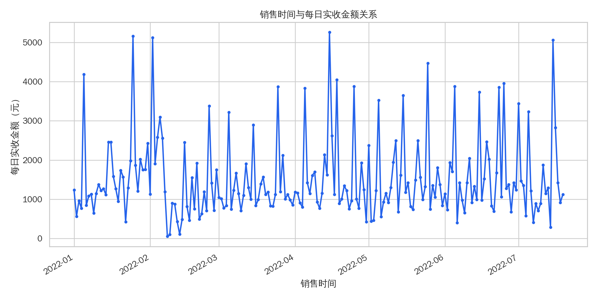
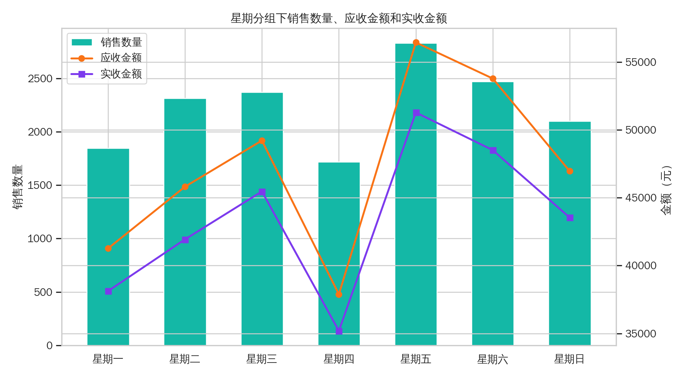
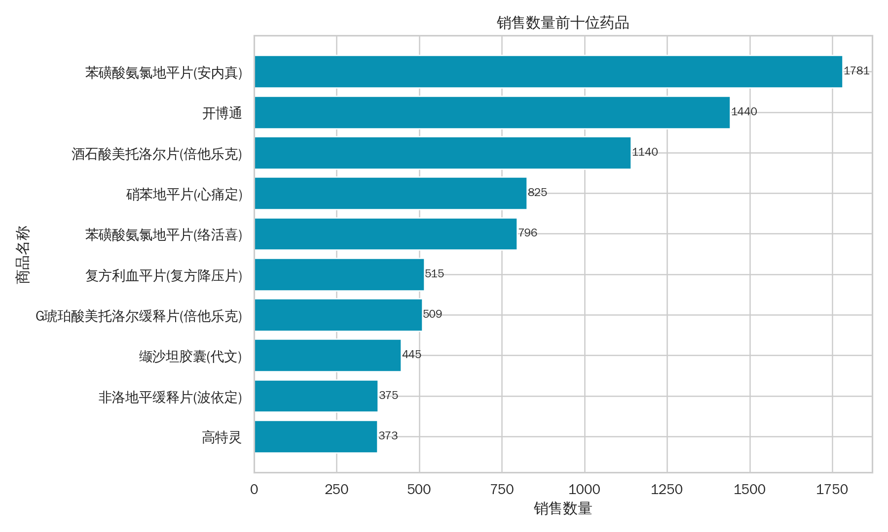

# 《Python数据收集与分析》期末考查报告

## 一、项目基本信息

| 项目 | 内容 |
| --- | --- |
| 项目名称 | 药品销售数据处理与分析 |
| 课程 | Python 数据收集与分析 |
| 数据文件 | `exam-materials/data/药品销售数据.xlsx` |
| 实现方式 | Python、Pandas、NumPy、Matplotlib、Seaborn |
| 运行入口 | `python main.py` |

## 二、项目目的

本项目围绕药品销售数据完成一次完整的数据分析流程，目标包括：

1. 掌握使用 Pandas 读取本地 Excel 数据的方法。
2. 能够查看数据结构、字段类型、缺失值和重复值情况。
3. 能够对销售时间、销售数量、应收金额和实收金额等字段进行规范化处理。
4. 能够识别并处理缺失值、无效日期、负数销售等异常数据。
5. 能够使用分组聚合完成月度、星期、商品维度的销售统计。
6. 能够使用 Matplotlib/Seaborn 生成可读的分析图表。
7. 能够将分析过程、结果和代码思路整理成报告和答辩材料。

## 三、数据概览

原始数据共 6578 行、8 列，字段如下：

| 字段 | 含义 |
| --- | --- |
| 购药时间 | 原始购买日期，后续修正为销售时间 |
| 社保卡号 | 顾客社保卡标识 |
| 商品编码 | 药品编码 |
| 商品名称 | 药品名称 |
| 销售数量 | 单笔销售数量 |
| 应收金额 | 按价格计算的应收金额 |
| 实收金额 | 实际收到金额 |
| 星期 | 原始星期信息 |

原始数据存在以下质量问题：

- `购药时间` 缺失 2 条。
- `社保卡号` 缺失 2 条。
- `商品编码`、`商品名称`、`销售数量`、`应收金额`、`实收金额` 各缺失 1 条。
- `星期` 缺失 2 条，且存在 `2022-02-29` 这样的错误星期值。
- 销售数量、应收金额和实收金额中存在小于或等于 0 的记录。
- 原始重复行数量为 0。

## 四、数据处理过程

### 4.1 数据加载

代码使用 `pandas.read_excel()` 读取 Excel 文件，并在加载后检查必要字段是否齐全。如果文件缺失或字段缺失，程序会直接抛出清晰错误，避免后续分析产生错误结果。

### 4.2 列名修正

根据考查要求，将原始列名 `购药时间` 修正为 `销售时间`。同时保留 `源数据行号`，便于在异常记录表中追溯原始 Excel 行。

### 4.3 重复值处理

程序基于 `销售时间、社保卡号、商品编码、商品名称、销售数量、应收金额、实收金额、星期` 检测重复记录。本次数据中重复记录为 0 行。

### 4.4 缺失值处理

缺失值分为两类处理：

- 对分析必需字段缺失的记录进行剔除，例如销售时间、商品名称、销售数量、应收金额、实收金额。
- 对不影响销售统计的社保卡号缺失记录，用 `未知社保卡` 标记保留。

### 4.5 数据类型统一

- `销售时间` 使用 `pandas.to_datetime()` 转换为 DateTime 类型。
- `销售数量` 转换为整型。
- `应收金额` 和 `实收金额` 转换为数值类型。
- `星期` 不直接采用原始列，而是根据标准化后的 `销售时间` 重新计算，避免错误星期值影响统计。

### 4.6 异常值检测与处理

本项目把异常分为两类：

| 异常类型 | 处理方式 | 原因 |
| --- | --- | --- |
| 无效日期、关键字段缺失、销售数量/金额小于等于 0 | 剔除 | 这类记录无法代表正常销售行为 |
| IQR 统计异常的大额或大数量记录 | 保留复核 | 医药销售中可能存在真实批量购买，不能只因数值大就删除 |

最终剔除确定错误记录 68 行，清洗后保留 6510 行有效数据。IQR 统计异常标记 2012 条，已输出到 `generated/tables/anomaly_rows.csv` 供复核。

## 五、数据分析结果

### 5.1 按销售时间排序

清洗后的数据按 `销售时间` 从小到大排序，并重置行索引。分析时间范围为 2022-01-01 至 2022-07-19。

### 5.2 月均销售金额

按月份统计实收金额：

| 月份 | 订单数 | 销售数量 | 实收金额 |
| --- | ---: | ---: | ---: |
| 2022-01 | 1055 | 2527 | 49461.19 |
| 2022-02 | 742 | 1858 | 38790.38 |
| 2022-03 | 990 | 2225 | 41597.51 |
| 2022-04 | 1235 | 3012 | 48822.56 |
| 2022-05 | 952 | 2225 | 46925.27 |
| 2022-06 | 909 | 2328 | 48327.70 |
| 2022-07 | 627 | 1483 | 30120.22 |

月均实收金额为 **43434.98 元**。其中 2022-01 的实收金额最高，为 49461.19 元。

### 5.3 销售时间与实收金额关系

从每日实收金额图可以看到，不同日期之间销售波动明显，部分日期存在高峰值。这类高峰通常与大额或批量购药记录有关，因此在清洗中没有直接删除，而是作为统计异常保留复核。

### 5.4 星期分组统计

| 星期 | 订单数 | 销售数量 | 应收金额 | 实收金额 |
| --- | ---: | ---: | ---: | ---: |
| 星期一 | 778 | 1847 | 41265.10 | 38123.47 |
| 星期二 | 976 | 2315 | 45814.40 | 41934.47 |
| 星期三 | 961 | 2373 | 49218.30 | 45466.81 |
| 星期四 | 692 | 1718 | 37885.30 | 35187.31 |
| 星期五 | 1160 | 2831 | 56446.30 | 51284.66 |
| 星期六 | 1028 | 2472 | 53786.70 | 48510.65 |
| 星期日 | 915 | 2102 | 46960.00 | 43537.46 |

星期五的订单数、销售数量、应收金额和实收金额均较高，是一周中销售表现最突出的日期。

### 5.5 销售数量前十位药品

| 排名 | 商品名称 | 订单数 | 销售数量 | 实收金额 |
| ---: | --- | ---: | ---: | ---: |
| 1 | 苯磺酸氨氯地平片(安内真) | 892 | 1781 | 19081.44 |
| 2 | 开博通 | 615 | 1440 | 37080.36 |
| 3 | 酒石酸美托洛尔片(倍他乐克) | 548 | 1140 | 7919.82 |
| 4 | 硝苯地平片(心痛定) | 420 | 825 | 1108.99 |
| 5 | 苯磺酸氨氯地平片(络活喜) | 318 | 796 | 24251.04 |
| 6 | 复方利血平片(复方降压片) | 304 | 515 | 1397.38 |
| 7 | G琥珀酸美托洛尔缓释片(倍他乐克) | 195 | 509 | 8620.96 |
| 8 | 缬沙坦胶囊(代文) | 143 | 445 | 16774.77 |
| 9 | 非洛地平缓释片(波依定) | 154 | 375 | 10419.56 |
| 10 | 高特灵 | 124 | 373 | 1997.95 |

销售数量最高的是苯磺酸氨氯地平片(安内真)，销售数量为 1781；开博通销售数量排第二，但实收金额较高，说明不同药品的价格差异会影响金额排名。

## 六、代码实现说明

入口文件为 `main.py`，完整流程由 `src/medicine_sales_analysis/pipeline.py` 调度。为了便于按评分点讲解，核心代码已拆成独立模块：

- `data_loading.py`：读取 Excel 并校验字段。
- `data_overview.py`：输出数据概览，并将 `购药时间` 修正为 `销售时间`。
- `data_cleaning.py`：处理重复值、缺失值、类型转换、异常值、星期重算、按销售时间排序并重置索引。
- `monthly_sales.py`：计算月度销售统计和月均实收金额。
- `time_actual_relationship.py`：汇总每日实收金额并生成销售时间关系图。
- `weekday_sales.py`：计算星期分组统计并生成星期统计图。
- `top_products.py`：计算销售数量前十位药品并生成 Top 10 图。
- `visualization.py`：统一配置图表中文字体和 PNG 输出后端。
- `outputs.py`：输出清洗数据、统计表、异常记录、质量摘要和运行摘要。

代码中对关键清洗策略、异常处理策略和图表生成逻辑都添加了说明性注释，便于答辩时解释实现思路。

## 七、个人总结

通过本次项目，我完整实践了从数据读取、数据概览、数据清洗、异常处理、分组统计到图表生成的分析流程。项目中最需要注意的是异常值处理不能简单“一删了之”：负数销售、无效日期和关键字段缺失属于确定错误，应当剔除；但大额销售或大数量销售可能是真实业务现象，因此更适合作为统计异常保留复核。

本项目最终形成了可运行代码、清洗数据、统计表、图表、报告和答辩文档，能够较完整地对应《Python数据收集与分析》期末考查的评分标准。
