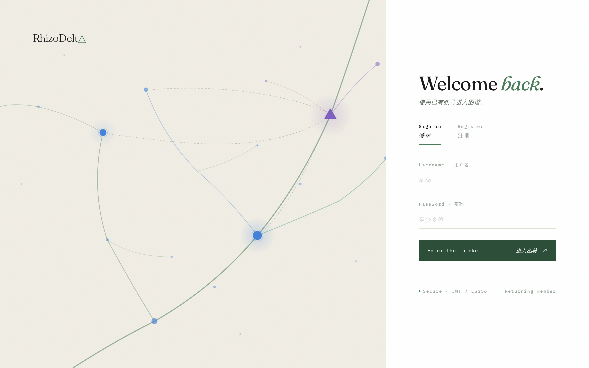
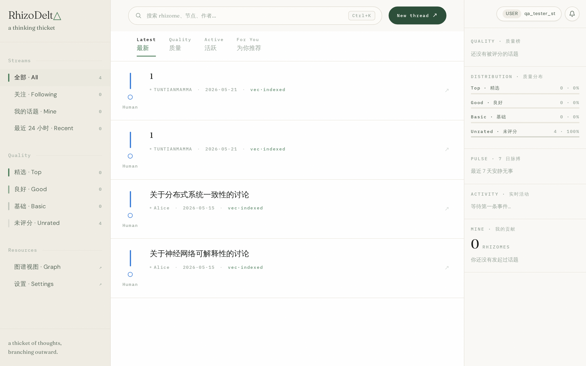
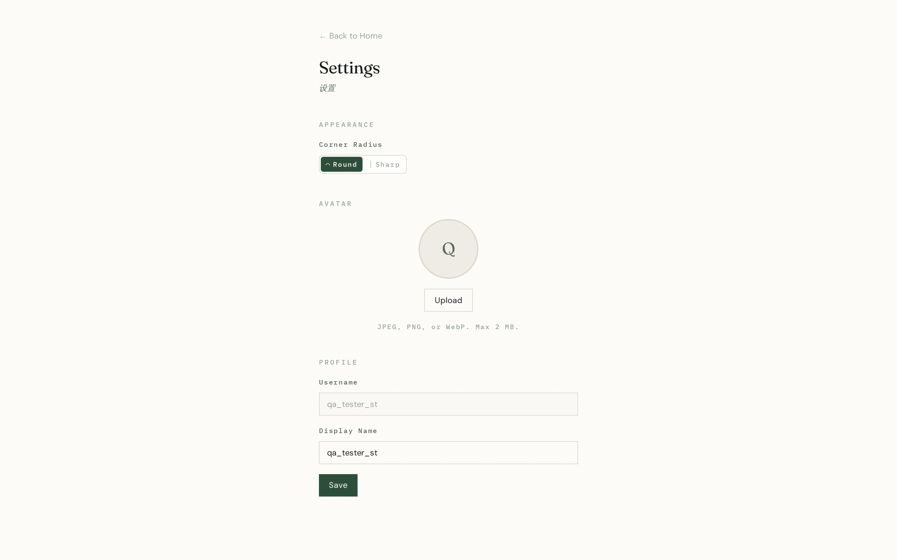
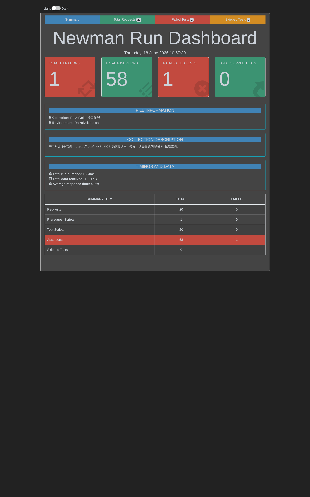
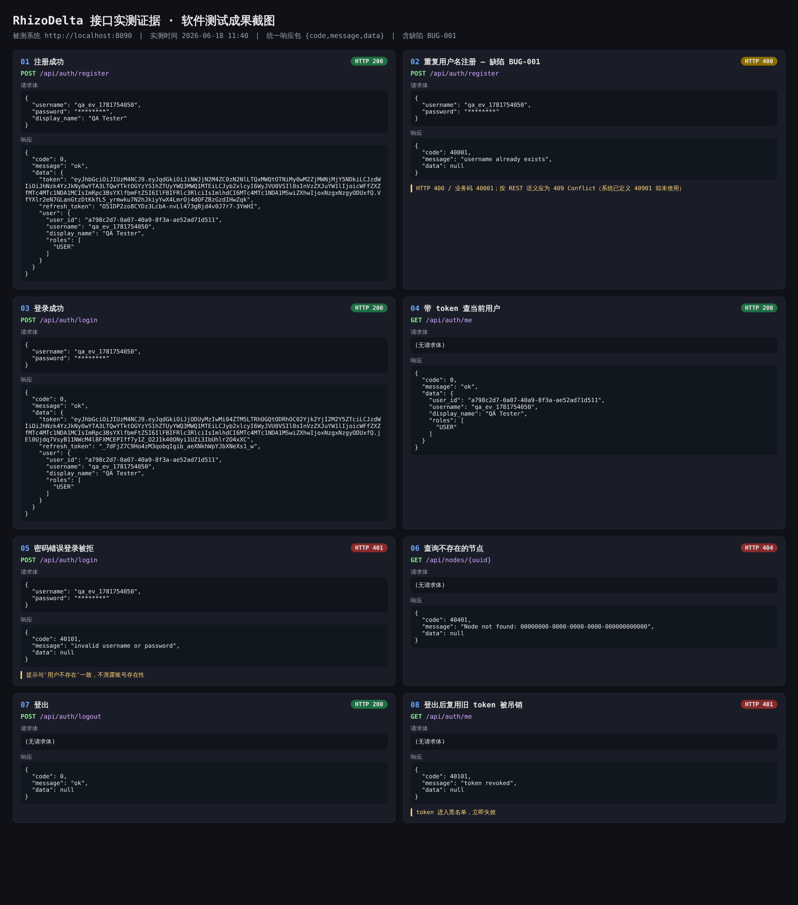

# 《软件测试技术》考查报告

> 封面字段对应模板《软件测试技术》考查报告（每人一份）.doc。提交版已使用模板副本生成：[《软件测试技术》考查报告.docx](./《软件测试技术》考查报告.docx) / [《软件测试技术》考查报告.doc](./《软件测试技术》考查报告.doc)。身份信息提交前统一替换"请填写"。

| 项目 | 内容 |
| --- | --- |
| 姓　　名 | 请填写 |
| 学　　号 | 请填写 |
| 系　　别 | 信息工程学院 |
| 专　　业 | 软件技术 |
| 年　　级 | 2024 级 |
| 班　　级 | 请填写 |
| 指导教师 | 请填写 |
| 起止日期 | 2026 年 　 月 　 日 至 2026 年 　 月 　 日 |
| 所在单位 | 2024 级 信息工程学院 软件技术 专业 |

## 项目名称

基于 RhizoDelta（图谱化非线性讨论系统）的软件测试

## 项目目的

1. 掌握软件测试的知识和方法（黑盒测试、用例设计方法、缺陷管理、接口测试）。
2. 建立测试的理念和思维模式（以需求为依据、以缺陷为产出、以质量结论收尾）。
3. 针对真实可运行的 B/S 系统完成一轮从测试方案到测试总结的完整测试活动。

## 实训内容及要求

1. 选定被测系统 RhizoDelta，划分功能模块并确定测试范围。
2. 编写《测试方案》《测试用例》《Bug 缺陷报告清单》《测试总结报告》四份文档。
3. 完成接口测试专项（Postman），含接口用例集与测试结果报告。
4. 提交所测项目界面截图及成果截图（见下节）。

## 界面与成果截图

### 一、被测系统界面截图（RhizoDelta，运行于 https://rhizodelta.toadtools.online）

*图 1　登录页——JWT 认证入口，对应认证授权模块。*

*图 2　登录后主界面——左侧话题流/质量筛选、中间讨论节点、右侧质量分布统计；右上角显示登录用户 qa_tester_st，对应登录与图谱查询模块。*

*图 3　个人设置页——头像上传、用户名/显示名编辑，对应用户资料与社交模块。*

### 二、测试成果截图

*图 4　newman 接口测试报告 dashboard——20 个请求全部发出，58 条断言通过 57，唯一失败项即缺陷 BUG-001。*

*图 5　8 条关键接口的真实"请求→响应"实证：登录/查当前用户/登出吊销均正确，重复注册暴露 BUG-001（应 409 实返 400），密码错误不泄露账号存在性。*

## 个人总结

本次测试从模板要求出发，围绕一个真实可运行的 B/S 系统完成了需求理解、测试计划、用例设计、接口自动化执行、缺陷登记和质量总结。通过认证、用户资料、图谱查询、登出吊销等 20 条用例，我进一步理解了黑盒测试中等价类、边界值、错误推测、因果图和场景法的组合使用方式。

Postman/newman 的自动化执行让测试结果具备可复现性，也暴露出重复注册状态码和时间字段格式一致性这类接口契约问题。综合来看，RhizoDelta 核心功能稳定，鉴权和错误处理整体可靠，后续应继续补充发帖异步一致性、头像上传、治理决策、SSE 和性能测试。

---

学生签名：____________

课程设计得分：____________　　课程设计报告：____________　　合计：____________

指导教师签字（签章）：____________
