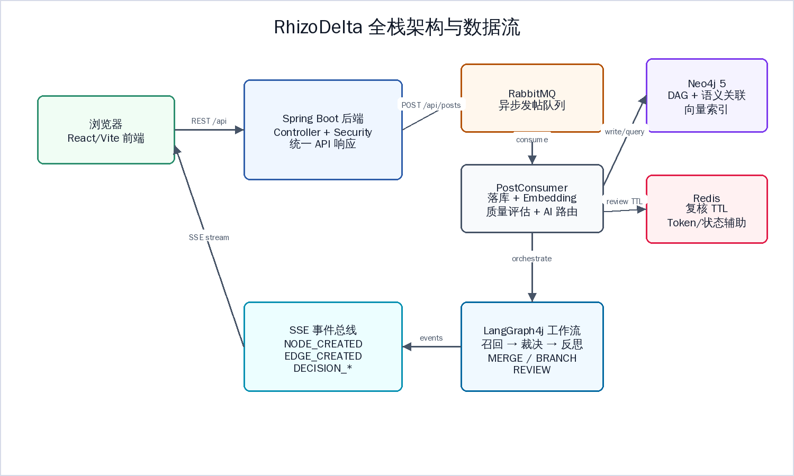

# 《Vue.js应用开发》期末课程设计报告

项目名称：RhizoDelta 图谱化非线性讨论系统前端

说明：按课程提交要求，本报告保留 Vue.js 课程封面与文件名；正文依据实际项目填写。实际前端技术栈为 React 19 + TypeScript + Vite。

代码仓库：https://github.com/TUNTIANHAMMA-2/RhizoDelta

本地开发目录：`/home/tthm/workspace/RhizoDelta/frontend`

## 一、项目概述

RhizoDelta 前端是一个图谱化讨论系统的交互界面。用户可以登录或注册，浏览根话题，进入图谱工作区查看观点的演进关系，发布新话题，对节点执行延续注入或分叉，并通过右侧详情面板查看溯源、关联和审计信息。桌面端使用 React Flow 展示 DAG 图谱，移动端使用嵌套讨论树降低复杂图形渲染成本。

## 二、需求分析

- 提供登录、注册和受保护路由。
- 首页展示根话题、信息流和右侧辅助信息。
- 工作区支持桌面图谱模式和移动端讨论树模式。
- 节点可查看详情、确权溯源、语义关联和审计时间线。
- 用户可以发布新话题、回复节点、执行延续注入和分叉。
- 前端需要监听 SSE，实时处理节点创建、边创建、决策完成、质量评分等事件。
- UI 需要适配桌面和移动端，保证大规模图谱场景下的交互可用性。

## 三、技术栈与开发环境

| 类别 | 技术 |
|---|---|
| UI 框架 | React 19 |
| 类型系统 | TypeScript 5.x |
| 构建工具 | Vite 8 |
| 路由 | React Router 7 |
| 图谱画布 | @xyflow/react, @dagrejs/dagre, d3-force |
| 状态管理 | Zustand 5 |
| 编辑器 | TipTap 3 + Markdown |
| 样式 | Tailwind CSS 4, CSS Design Tokens |
| 测试 | Vitest, Testing Library |

## 四、前端总体架构


前端入口为 `src/main.tsx` 和 `src/App.tsx`。`App.tsx` 管理路由和鉴权保护：`/login` 是公开路由，`/`、`/workspace`、`/workspace/:rhizomeId`、`/settings` 都需要有效 token。`GraphWorkspace` 根据视口宽度选择桌面图谱工作区或移动端讨论树。

## 五、页面与组件设计

### 5.1 登录/注册页

`LoginPage.tsx` 调用 `/api/auth/login` 和 `/api/auth/register`，成功后把 access token 写入 `localStorage.jwt_token`，并交给 `authStore` 维护用户身份、角色和会话状态。

### 5.2 首页

首页由 `HomePage` 及 `HomeSidebar`、`HomeMainColumn`、`HomeRightRail` 等组件组成，用于展示根话题、动态信息和个人化入口。

### 5.3 工作区

桌面端 `DesktopGraphWorkspace` 组合左侧话题列表、中间 React Flow 画布和右侧详情面板。画布支持版本视图和探索视图，节点点击后可打开 `NodeDetailPanel`，工具条可触发注入和分叉操作。

### 5.4 移动端讨论树

移动端不直接挂载复杂图谱画布，而是请求 `/api/nodes/{id}/discussion-tree`，由 `MobileDiscussionTreeView`、`CommentTreeItem`、`MobileReplyComposer` 和 `LongPressMenu` 展示更适合小屏阅读的嵌套讨论结构。

## 六、API 封装与状态管理

`src/api/client.ts` 是统一请求入口，自动附加 `Authorization: Bearer <token>`，并处理统一响应结构 `{code, message, data}`。领域 API 被拆分为 `auth.ts`、`nodes.ts`、`posts.ts`、`decisions.ts`、`associations.ts`、`audit.ts`、`profile.ts`、`feed.ts`、`events.ts` 等。

Zustand Store 按职责拆分：`authStore` 管理登录状态，`graphStore` 管理节点、边、选择态和图谱视图，`sseStore` 管理连接状态，`homeStore` 管理首页数据，`discussionTreeStore` 管理移动端讨论树，`uiStore` 管理侧边栏、右面板和 toast。

## 七、实时更新与交互流程

前端通过 `useSse.ts` 请求 `/api/events/stream`。连接建立后解析 SSE 文本块，并根据事件类型更新 store：

- `NODE_CREATED`：拉取新节点并加入图谱。
- `EDGE_CREATED`：补齐端点节点后加入关系边。
- `DECISION_COMPLETE`：替换乐观节点并展示结果。
- `ORCHESTRATION_STATUS`：更新编排状态。
- `SUMMARY_GENERATED`、`QUALITY_SCORED`：刷新摘要和质量徽章。



## 八、界面风格与响应式设计

项目采用 Botanical Observatory / Wikipedia-Notion 风格：暖纸色背景、植物学绿色强调色、内容区衬线字体、控件区无衬线字体。核心 design token 位于 `src/styles/tokens.css`。界面在桌面端提供三栏工作台，在移动端切换为讨论树和轻量操作菜单。

## 九、运行、构建与测试

前端运行命令：

```bash
cd frontend
npm install
npm run dev
```

构建命令：

```bash
npm run build
```

Lint 与测试：

```bash
npm run lint
npx vitest
```

当前前端包含 118 个 TypeScript/CSS 源文件和多组测试文件，覆盖表单、节点操作、移动端组件、Markdown 工具、SSE 事件、viewport hook 和 Zustand store。

## 十、总结

本项目前端重点解决了图谱型应用中“数据结构复杂、实时事件多、桌面与移动体验差异大”的问题。通过 API 分层、Zustand 状态拆分、React Flow 图谱渲染、SSE 增量更新和移动端讨论树降级方案，系统形成了较完整的前端工程实践。虽然课程名称为 Vue.js 应用开发，本报告正文按照学校允许的实际项目内容填写，保留课程封面和文件名要求。
