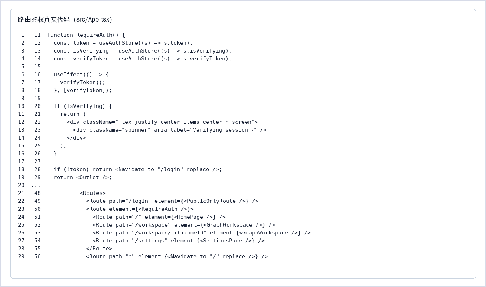
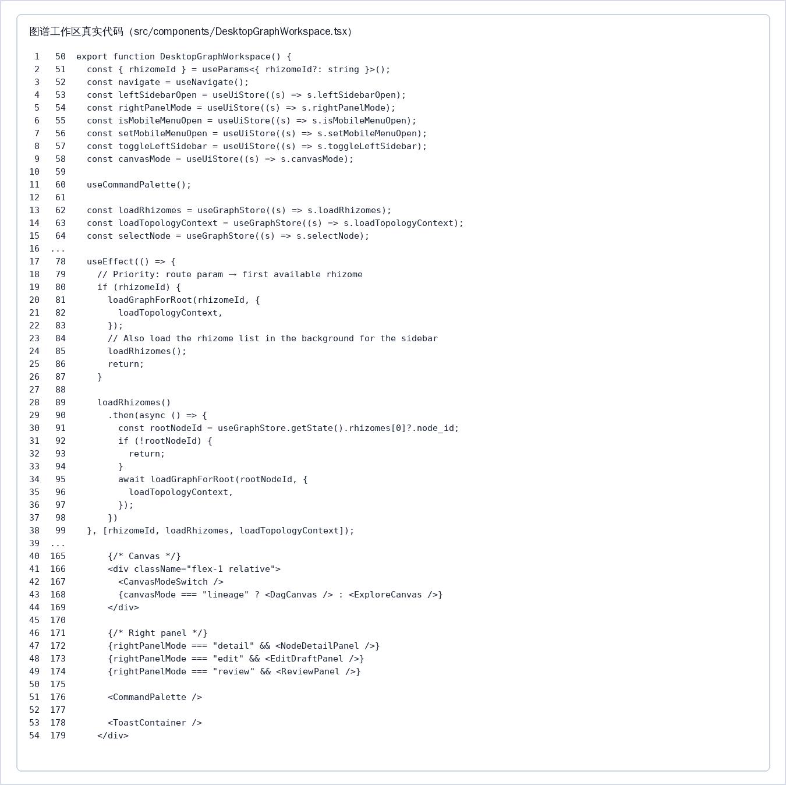
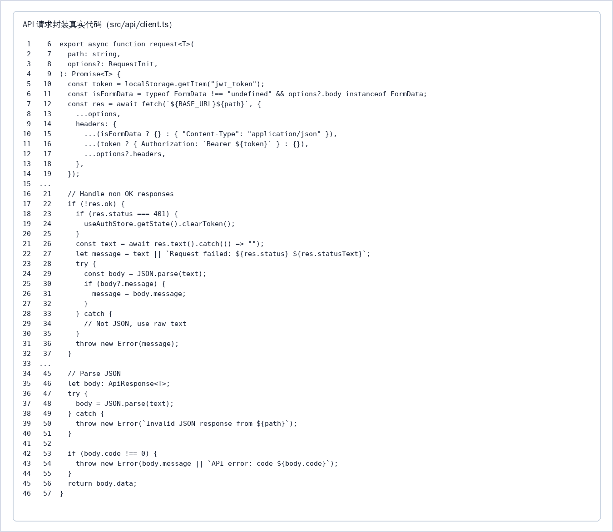
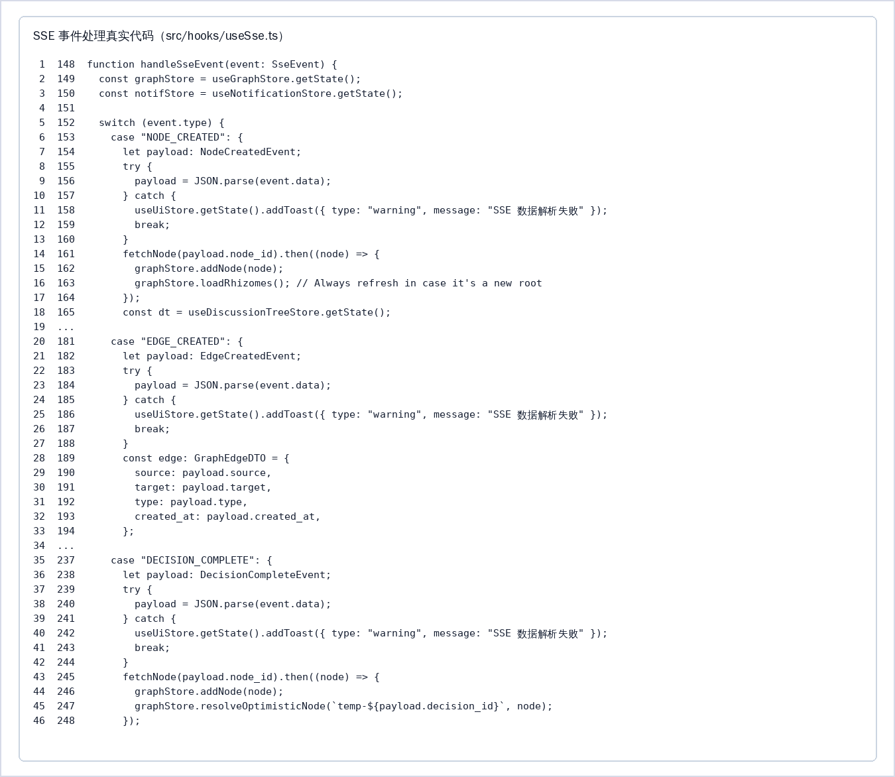
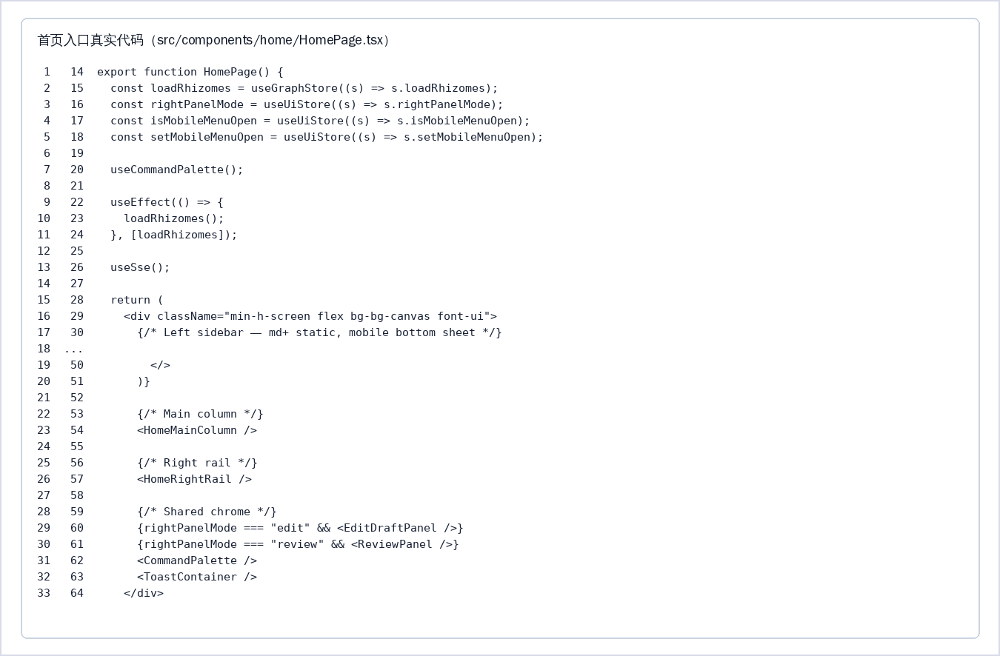
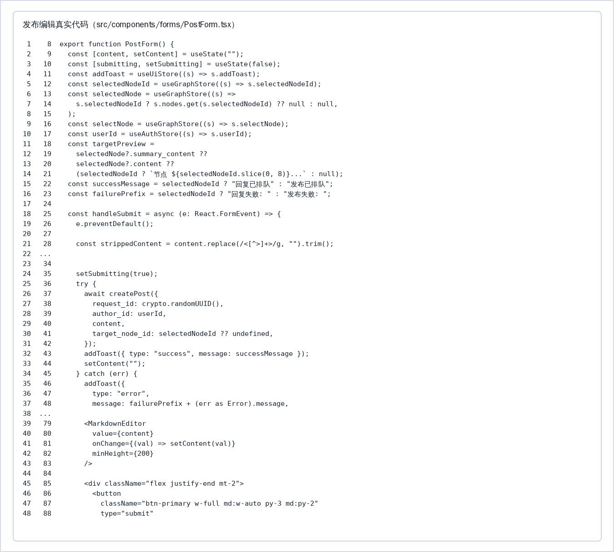
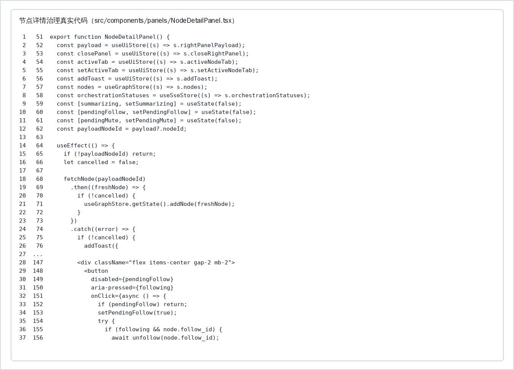
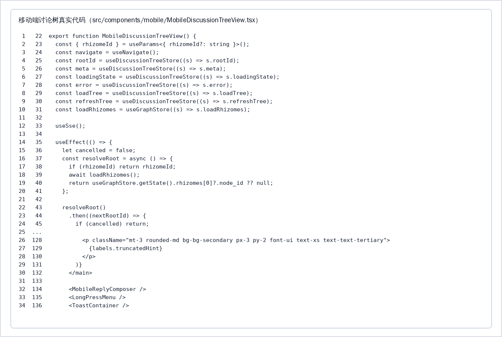
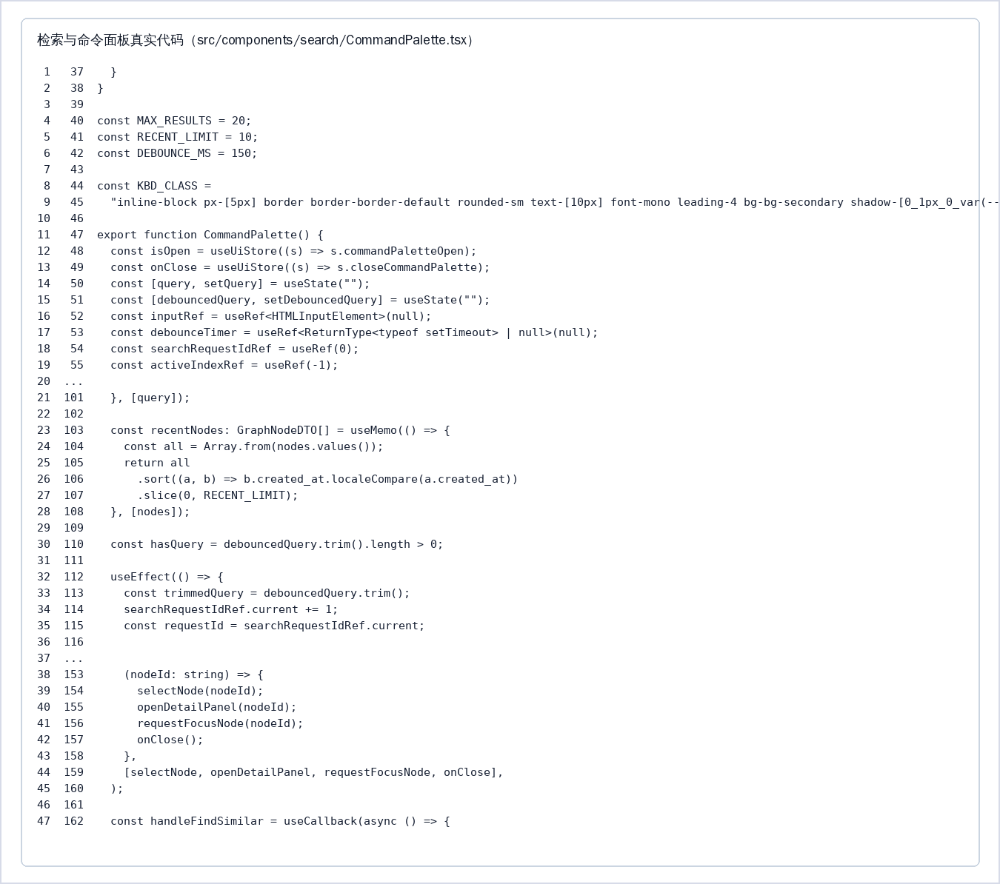
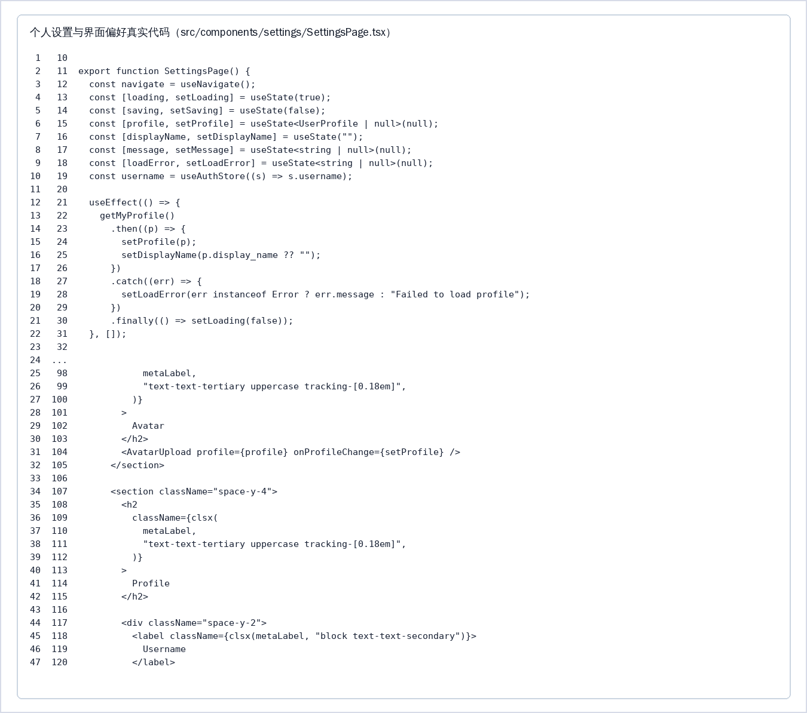

# 《Vue.js应用开发》期末课程设计报告

项目名称：RhizoDelta 图谱化非线性讨论系统前端实现

代码仓库：https://github.com/TUNTIANHAMMA-2/RhizoDelta

本地开发目录：`/home/tthm/workspace/RhizoDelta/frontend`

## 1 项目概述

### 1.1 项目背景

按照《Vue.js应用开发》课程的要求，需要提交一份前端课程设计报告并附带 Word 文档。这里先做一点说明：报告文件名和课程目录之所以仍带有 Vue.js 字样，是课程规定使然，而项目落地时采用的其实是 React 技术栈。为避免把一套 React 系统硬套成 Vue 的写法，下文一律以 /home/tthm/workspace/RhizoDelta/frontend 目录下真实的 React、TypeScript、Vite 源码为依据展开。

RhizoDelta 是一套图谱化的非线性讨论系统，它瞄准的是“多人针对同一议题展开发散讨论、并逐步沉淀出共识”这样的使用场景。常见的论坛、群聊、评论区大多沿时间线把内容一条条排下去，讨论一长，观点之间谁继承了谁、在哪里出现分歧、又如何合并、怎样发生转化，就很难一眼看清；等到讨论体量更大，重复的表态、分支里的争论、补充进来的证据以及阶段性小结全混在一处，新加入的人不得不来回翻历史消息，管理者也说不清某个结论究竟源自哪几条原始发言。前端这一侧由 React 页面、React Router 路由、Zustand 状态、基于 fetch 的 API 客户端、SSE 事件处理以及 React Flow 图谱画布协同应对上述困境：图里的节点对应用户观点、AI 共识或阶段性结果，连线则表达延续、分叉、合并、语义关联等若干种关系；用户既能从某个根话题进入工作区追踪观点的演变，也能在手机上借助讨论树来阅读。本报告即立足于 React 19.2.4、TypeScript 5.9.3、Vite 8.0.0 的真实工程，围绕组件化、路由鉴权、接口封装、状态管理、响应式布局、实时更新等方面，梳理其中涉及的前端开发能力。

### 1.2 项目目标

本项目的功能目标是完成一套可运行的图谱化讨论前端：用户能够注册、登录和保持会话；首页能够展示根话题、信息流和辅助入口；工作区能够按桌面端图谱模式和移动端讨论树模式呈现节点关系；节点详情面板能够展示正文、作者、质量评分、溯源、关联和审计信息；用户能够发布新话题、回复节点，并根据权限执行延续注入、分叉和复核等操作；前端还要通过 SSE 实时接收后端事件，使节点创建、边创建、AI 裁决完成和质量评分可以增量刷新。上述目标来自 src/App.tsx、src/components/GraphWorkspace.tsx、src/components/DesktopGraphWorkspace.tsx、src/components/mobile/MobileDiscussionTreeView.tsx、src/api/client.ts 和 src/hooks/useSse.ts 等真实源码。技术目标是掌握 React 函数组件、Hooks、React Router 嵌套路由、Zustand store、统一 fetch 请求封装、TypeScript 类型约束、Vite 构建、Tailwind 样式和 Vitest 测试等现代前端工程能力。

## 2 技术选型

### 2.1 前端技术栈

UI 框架与语言：真实工程在 package.json 中声明 React 19.2.4、TypeScript 5.9.3 和 Vite 8.0.0。页面由函数组件和 Hooks 组织，入口在 src/main.tsx 与 src/App.tsx，业务组件分布在 src/components/ 下。

路由与页面组织：项目使用 React Router 7.13.1 管理 /login、/、/workspace、/workspace/:rhizomeId 和 /settings 等页面。src/App.tsx 中通过 BrowserRouter、Routes、Route、Navigate、Outlet、RequireAuth 和 PublicOnlyRoute 实现公开路由与受保护路由。

状态管理：项目使用 Zustand 5.0.12，按职责拆分 authStore、graphStore、sseStore、homeStore、discussionTreeStore 和 uiStore。认证、图谱、SSE、首页、移动端讨论树和界面状态互相独立，组件通过 store action 更新状态。

UI 与图谱渲染：项目使用 Tailwind CSS 4.2.2、CSS Design Tokens、@xyflow/react 12.10.1、@dagrejs/dagre 2.0.4 和 d3-force 3.0.0 实现布局、主题、图谱节点边渲染和布局计算。

接口、编辑器与测试：统一 API 客户端在 src/api/client.ts 中使用原生 fetch，负责附加 JWT token、处理 401 和解析 {code, message, data} 响应结构；TipTap 3.20.5 与 Markdown 工具用于内容编辑；Vitest 4.1.1、Testing Library 和 ESLint 9.39.4 用于质量保障。

### 2.2 后端技术栈（可选）

项目后端由 Java 17、Spring Boot 3.2.3、Spring Security、Neo4j 5、RabbitMQ、Redis 和 SSE 事件服务组成。前端通过 /api/** 访问后端 REST 接口，通过 /api/events/stream 订阅实时事件。后端负责用户认证、节点查询、发帖异步处理、AI 路由决策、图数据库写入和审计记录，前端负责把这些数据转换为用户可理解、可操作的 React 页面状态。

## 3 需求分析

### 3.1 功能需求

（1）用户模块：支持注册、登录、退出和 token 持久化。登录成功后进入受保护页面，未登录用户访问工作区或设置页时自动跳转到登录页。

（2）首页模块：展示根话题列表、动态信息和右侧辅助入口，帮助用户快速找到正在讨论的主题，并进入指定话题的工作区。

（3）图谱工作区模块：桌面端展示图谱画布、话题列表和右侧详情面板；用户可以缩放、选择节点、查看节点关系、切换谱系视图和探索视图。

（4）移动端讨论树模块：小屏设备不直接挂载复杂图谱画布，而是请求 discussion-tree 接口，用嵌套评论树展示讨论结构，并提供长按菜单和移动端回复输入。

（5）节点详情与治理模块：节点详情面板展示正文、作者、质量评分、溯源、关联和审计时间线；具备权限的用户可以触发延续注入、分叉、复核和其他治理操作。

（6）实时更新模块：前端监听 SSE 事件，并根据 NODE_CREATED、EDGE_CREATED、DECISION_COMPLETE、ORCHESTRATION_STATUS、SUMMARY_GENERATED 和 QUALITY_SCORED 等事件增量更新页面。

### 3.2 非功能性需求

性能方面，桌面端图谱需要避免无意义重绘，移动端需要使用讨论树降低复杂画布渲染成本；接口请求应使用统一封装，避免重复处理 token 和错误提示。兼容性方面，项目面向现代浏览器，支持桌面和移动端响应式布局。安全性方面，受保护路由必须检查认证状态，请求头必须携带 Bearer token，前端不能把权限判断作为唯一安全边界。可维护性方面，页面组件、API 模块、store 和工具函数按职责拆分，测试覆盖表单、节点操作、移动端组件、Markdown 工具、SSE 事件和状态管理。

## 4 详细设计

### 4.1 开发环境

本项目开发环境为 Linux 工作站，代码编辑工具为 Visual Studio Code 或同类编辑器，前端目录位于 /home/tthm/workspace/RhizoDelta/frontend。项目使用 Node.js、npm、Vite 8.0.0、TypeScript 5.9.3、ESLint 9.39.4、Vitest 4.1.1 和 Testing Library 完成开发、构建、代码检查和测试。常用命令来自 package.json，包括 npm run dev、npm run build、npm run lint 和测试命令 npx vitest。本报告内容逐项核对了 package.json、src/App.tsx、src/api/client.ts、src/api/nodes.ts、src/hooks/useSse.ts、src/stores/*.ts、src/components/GraphWorkspace.tsx、src/components/DesktopGraphWorkspace.tsx 和 src/components/mobile/MobileDiscussionTreeView.tsx。后端联调时需要先启动 Spring Boot 服务，并保证 Vite 将 /api 代理到 http://localhost:8090。

### 4.2 路由与鉴权模块

路由与鉴权模块负责把公开页面和受保护页面分开。/login 允许未登录用户访问，首页、工作区和设置页都需要有效 token。用户登录成功后，认证信息写入本地存储并同步到 authStore；刷新页面时，RequireAuth 调用 verifyToken 恢复会话状态。该模块的实现重点是避免未认证用户直接进入业务页面，同时避免每个页面重复编写登录判断逻辑，因此把鉴权逻辑抽象到 React Router 外层组件中。

> 效果图占位：登录页、登录后首页或未登录跳转登录页截图。

### 4.3 图谱工作区模块

图谱工作区是前端最核心的功能模块。桌面端由左侧话题列表、中间 React Flow 图谱画布和右侧详情面板组成：左侧帮助用户切换根话题，中间画布负责展示节点和边，右侧详情面板展示当前选中节点的内容、作者、溯源、关联和审计信息。画布支持谱系视图和探索视图，前者强调从根话题到当前结论的演进关系，后者强调语义关联和分支扩展。移动端由于屏幕空间有限，不直接挂载复杂画布，而是使用 discussion-tree 接口把讨论呈现为嵌套阅读结构。

> 效果图占位：桌面端图谱工作区三栏布局截图，包含左侧话题列表、中间图谱画布和右侧详情面板。

### 4.4 API 封装与状态管理模块

API 封装模块以 src/api/client.ts 为统一入口，自动附加 Authorization: Bearer <token>，并统一处理后端返回的 {code, message, data} 结构。业务接口按领域拆分为 auth、nodes、posts、decisions、associations、audit、profile、feed、events、search、follows 和 mutes 等文件，页面组件不直接拼接底层请求细节。

状态管理模块按职责拆分 store：authStore 管理登录状态，graphStore 管理节点、边、选择态和图谱视图，sseStore 管理连接状态，homeStore 管理首页数据，discussionTreeStore 管理移动端讨论树，uiStore 管理侧边栏、右面板、命令面板和 toast。API 与 store 的分层让组件只关注业务交互，错误处理、token 处理和数据建模集中管理，也便于对表单、移动端组件、SSE 和 store 单独测试。

### 4.5 实时更新模块

实时更新模块通过 useSse.ts 请求 /api/events/stream。连接建立后，前端持续解析后端推送的事件，并根据事件类型决定更新策略：节点创建事件会补拉节点并加入图谱，边创建事件会补齐端点关系，决策完成事件会替换乐观节点，摘要生成和质量评分事件会刷新节点徽章。该模块的难点是保证实时性和一致性之间的平衡，既不能因为频繁刷新造成页面抖动，也不能因为缓存过旧导致图谱状态和后端不一致。

> 效果图占位：发帖后节点增量出现、边关系刷新或质量评分更新截图。

### 4.6 首页与话题入口模块

首页与话题入口模块负责登录后的第一层信息组织。HomePage 进入页面后调用 graphStore 的 loadRhizomes 拉取根话题，用 HomeSidebar、HomeMainColumn 和 HomeRightRail 组成左侧导航、中间主列、右侧辅助栏的三栏结构；移动端则把侧边导航切换为底部弹层，避免小屏空间被固定侧栏占用。

实现过程中，首页组件本身只承担装配职责，数据读取和界面状态分别交给 graphStore 与 uiStore 管理，同时接入 useSse 和 useCommandPalette，使首屏可以响应实时事件并打开全局检索。这个模块体现了项目的信息架构能力：用户不是直接面对复杂图谱画布，而是先通过根话题、动态信息和快捷入口理解系统当前状态，再进入具体工作区。

### 4.7 发布与回复编辑模块

发布与回复编辑模块负责把用户输入转化为后端可异步处理的发帖请求。PostForm 使用 MarkdownEditor 管理正文，根据 selectedNodeId 判断当前是发布新话题还是回复已有节点，并在界面上展示“正在回复”的目标摘要，用户也可以取消回复回到新发布状态。

提交时，handleSubmit 会先去除 HTML 标签检查空内容，再校验当前登录用户，随后调用 createPost 传入 request_id、author_id、content 和 target_node_id。接口返回后前端显示“发布已排队”或“回复已排队”的 toast，不阻塞等待 AI 裁决完成，而是由后续 SSE 事件推动图谱更新。该流程展示了项目对异步业务的处理能力：用户交互保持及时反馈，复杂决策交给后端队列和实时事件链路完成。

### 4.8 节点详情与治理模块

节点详情与治理模块是图谱工作区中承载深度信息的关键页面。用户选中节点后，NodeDetailPanel 会根据 rightPanelPayload 打开右侧面板，展示节点类型、作者、创建时间、正文内容、AI 决策说明、质量状态和编排状态，并通过“详情、确权溯源、关联、审计”标签页组织不同维度的信息。

实现过程中，面板会在打开时调用 fetchNode 获取最新节点数据，并用 graphStore.addNode 写回本地状态，避免详情面板展示过期缓存。关注、取消关注、屏蔽、取消屏蔽和摘要生成等操作都通过独立 API 完成，操作后立即更新 store 并给出 toast 反馈。该模块把节点从简单图形元素提升为可审计、可治理、可追踪的业务对象，是本项目区别于普通评论列表的重要亮点。

### 4.9 移动端讨论树模块

移动端讨论树模块解决了复杂图谱在小屏设备上难以阅读和操作的问题。GraphWorkspace 根据视口宽度选择桌面图谱或移动端讨论树；MobileDiscussionTreeView 根据路由参数确定根节点，没有指定根节点时先加载根话题并选择第一个话题进入。

实现过程中，移动端视图通过 discussionTreeStore 加载 discussion-tree 数据，使用 Skeleton 展示加载态，加载完成后由 CommentTreeItem 递归渲染嵌套评论结构，并配合 MobileReplyComposer、LongPressMenu 和 ToastContainer 完成回复、长按菜单和反馈提示。页面在浏览器重新可见时自动 refreshTree，保证移动端返回页面后内容仍然及时。该模块体现了项目对响应式体验的深入处理：桌面保留图谱探索能力，移动端则转为更适合阅读和回复的线性树结构。

### 4.10 检索与命令面板模块

检索与命令面板模块用于解决大规模图谱中节点定位困难的问题。CommandPalette 打开后会聚合最近节点、关键词相似检索和当前节点向量相似检索，用户可以通过输入框、方向键和回车快速跳转到目标节点。

实现过程中，模块对输入内容做 150ms 防抖，调用 searchSimilar 发起文本检索；当用户选择“查找相似节点”时，先通过 fetchEmbedding 取得当前节点向量，再提交向量相似检索。如果目标节点当前不在本地图谱中，模块会先调用 loadTopologyContext 补拉上下文，再 selectNode、requestFocusNode 并打开详情面板。该模块体现了项目对复杂信息检索的工程化处理，让图谱系统不仅能展示关系，也能高效定位和导航。

### 4.11 个人设置与界面偏好模块

个人设置与界面偏好模块用于补齐系统的用户资料维护能力。SettingsPage 进入后调用 getMyProfile 加载当前用户资料，展示用户名、头像、展示名称和界面外观设置，并通过 RadiusModeToggle 支持界面圆角偏好切换。

实现过程中，页面分别处理 loading、saving、loadError 和 message 状态，保存展示名称时调用 updateProfile 并把返回的 UserProfile 写回本地状态；头像上传交给 AvatarUpload 组件完成，认证用户名来自 authStore。该模块虽然不是图谱核心链路，但体现了应用完整性：系统不仅能完成讨论和治理，也提供了真实产品中必需的个人资料和界面偏好入口。

### 4.x 难点与解决方案

第一个难点是图谱数据复杂。节点、边、语义关联和审计记录来自不同接口，如果组件直接处理所有格式，代码会迅速膨胀。解决方法是在 API 层和 store 层完成数据转换，让画布组件只关心可渲染节点和边。第二个难点是桌面端和移动端交互差异大。复杂图谱适合大屏，而移动端更适合线性阅读，因此项目按视口选择桌面图谱或移动讨论树。第三个难点是实时事件多。项目通过事件类型分发和局部更新减少全量刷新，同时保留必要的补拉逻辑，保证用户看到的数据最终与后端一致。第四个难点是复杂业务入口多，如果所有操作都堆在画布上会影响学习成本，因此项目通过首页、命令面板、详情面板和设置页分担入口，让用户可以按任务路径进入相应功能。

## 5 总结与展望

### 5.1 项目总结

通过本项目的开发，可以系统理解 React 前端工程中函数组件、Hooks、路由管理、状态管理、接口封装、响应式布局、实时事件处理和测试验证等核心技术。项目优点是模块边界清晰、桌面与移动端体验分层、实时更新链路完整；不足是图谱场景对首次理解成本较高，真实页面截图、端到端测试和自动化部署说明仍可进一步补充。虽然提交文件名按课程要求保留 Vue.js，但报告内容已经按真实 React/Vite 代码实现编写。

### 5.2 未来展望

后续可以从三个方向继续优化。第一，增加更多端到端测试，覆盖登录、发帖、图谱切换、移动端回复和 SSE 增量刷新等完整用户流程。第二，补充真实运行截图、关键 React 源码白底截图和部署截图，使课程报告中的“先文后图”材料更接近最终答辩展示。第三，继续优化 React Flow 大图谱性能，例如节点虚拟化、布局缓存、SSE 事件批处理和移动端数据预取，从而提升大规模讨论场景下的交互稳定性。
